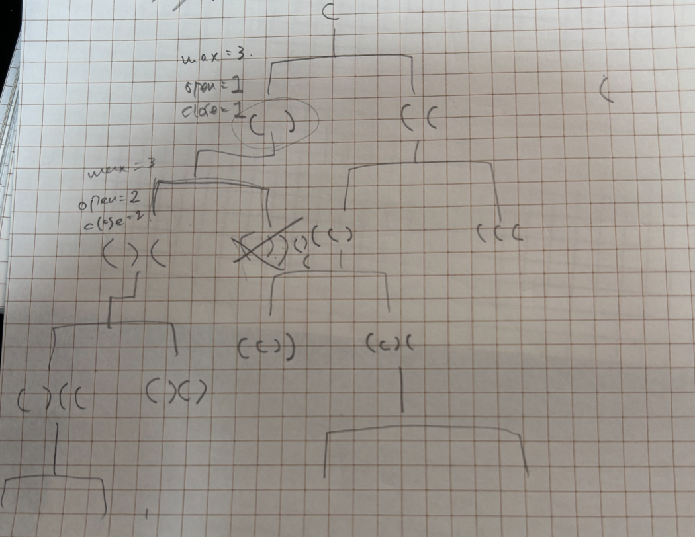

## 1st
- 問題
    - ()のペア数が与えられるので、それを元に適切な (, ) の組み合わせを作成して全て返却せよ
    - () のペア数n は最大 1 <= n <= 8 の範囲
- 方針
  - n が大きいわけではないので、全列挙して問題なさそう
  - スタックには最大 n*2 程度しか積まないので、最大16個の再帰関数が乗るイメージになる
  - その上で、今回は () が正常に閉じられているどうか？をどう判定すればいいかが自分のキモになる
  - 以前、Stack で (),[],{} を順序よく追加できているかどうか？みたいな、linter がやってくれている構文解析の初歩的なやつを書いたけど、これと同じでいいか？
  - それとももっとシンプルに書けるか？
  - 
  - 上の図がまず頭に浮かんで、そのあと正しい () を生成するのにどうする？を考えるのに時間がかかりすぎた
  - 前回の for で全列挙がすぐ頭に出てきてしまった
  - もっとシンプルに再帰的に呼ぶだけでいいっていうのを理解した
  - その際、open, close で管理すればいいよねの発想に至るのも遅かった
  - まだバックトラッキング初めて日が浅いので、まあ仕方ない
  - 2nd でもう少しすんなりいけるようになると嬉しい
- 実装
  - やりながら30分経ってしまったのと、もっとシンプルにできることに気がついて、一部 chatGpt に壁打ちしながら以下のコードを完成品とした
  - いっぺんに二つのことを考えるのが苦手なので、どうやったらよりシンプルにできるのか？を常に考えないとダメね。。。
  - 最大でも 16文字しか生成しないので、StringBuffer ではなく、String でいいと判断した
```java
class Solution {
    public List<String> generateParenthesis(int n) {
        List<String> result = new ArrayList<>();
        dfs(n, "", 0, 0, result);
        return result;
    }

    private void dfs(int max, String current, int open, int close, List<String> result) {
        if (current.length() == max * 2) {
            result.add(current);
            return;
        }

        if (open < max) {
            dfs(max, current + "(", open + 1, close, result);            
        }

        if (close < open) {
            dfs(max, current + ")", open, close + 1, result);
        }
    }
}
```
- 感想
  - とはいえ、やはり空間計算量が増えることに違いはないので StringBuffer でも書いてみた
  - こっちは String と違って StringBuffer が参照型なので、remove してあげないといけない
```java
class Solution {
    public List<String> generateParenthesis(int n) {
        List<String> result = new ArrayList<>();
        dfs(n, new StringBuffer(), 0, 0, result);
        return result;
    }

    private void dfs(int max, StringBuffer sb, int open, int close, List<String> result) {
        if (sb.length() == max * 2) {
            result.add(sb.toString());
            return;
        }

        if (open < max) {
            sb.append('(');
            dfs(max, sb, open + 1, close, result);
            sb.deleteCharAt(sb.length() - 1);
        }

        if (close < open) {
            sb.append(')');
            dfs(max, sb, open, close + 1, result);
            sb.deleteCharAt(sb.length() - 1);           
        }
    }
}
```


## 2nd

## 3rd

## 4th

## 5th
