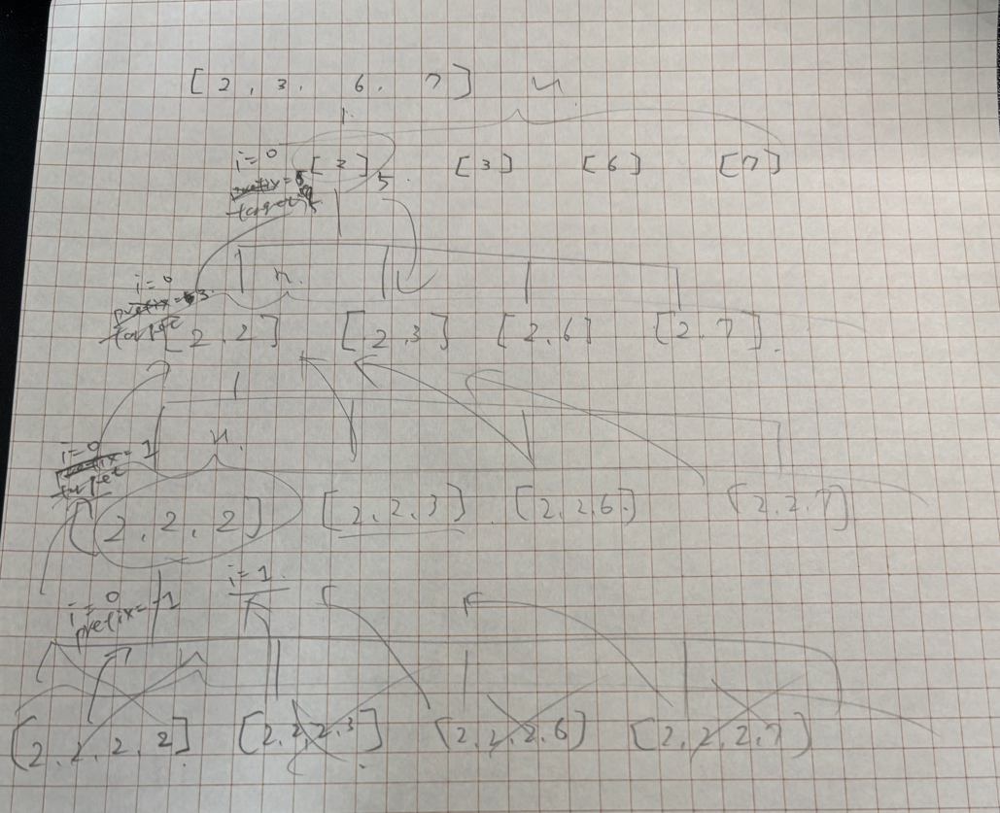
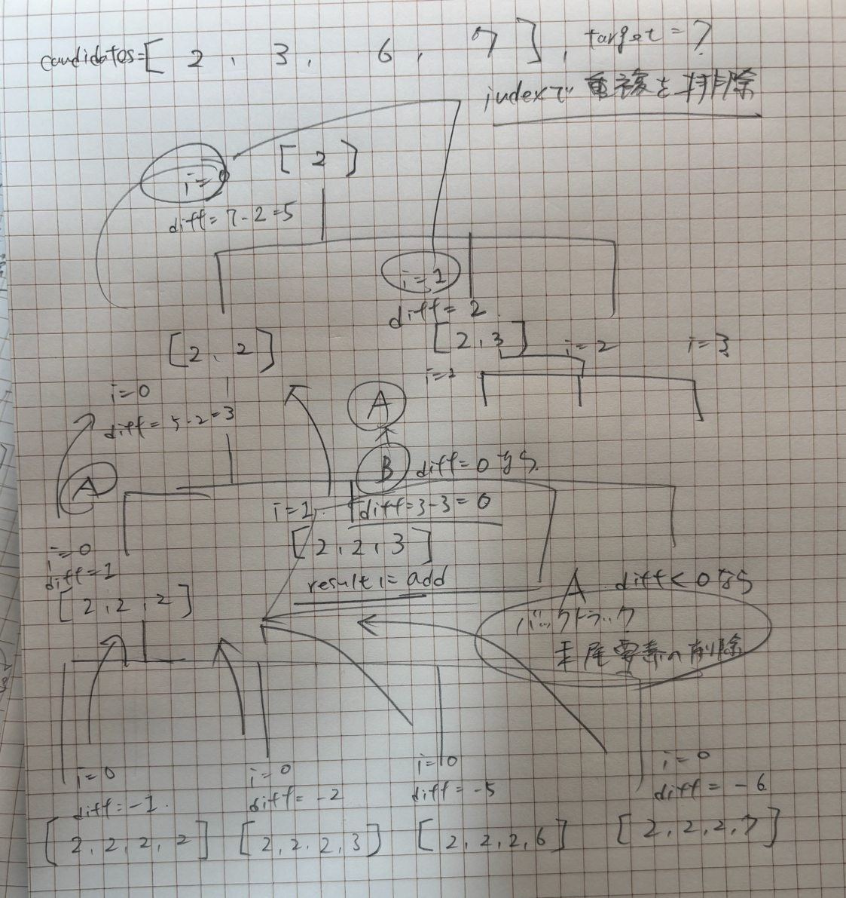
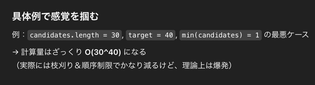
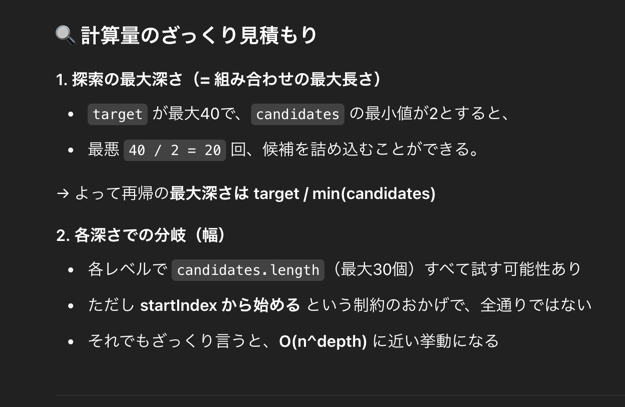
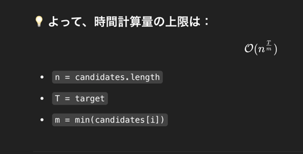

## 1st
- 問題
    - candidates[] と target が与えられるので、candidates の中の組み合わせ(Combination)の和が target と等しくなるような combination を返せ
- 方針
  - 全列挙なのでバックトラッキングが使えそう
  - 問題を解く際に以下の絵が見えた
    - 最初に思いついた雑な方針
    - 
    - ちょっと綺麗にした方針
    - 
  - 計算量の観点
    - `candidates.length` が 30 なので一度にスタックに積むのは 30程度、 Stack Over Flow はしなさそう
    - 大まかな計算量が概算できないので練習
      - 時間計算量は、**「探索空間の最大幅 × 探索の最大深さ」**
      - 
      - 
      - 
- 実装
```java
class Solution {
  public List<List<Integer>> combinationSum(int[] candidates, int target) {
    List<List<Integer>> result = new ArrayList<>();
    ArrayList<Integer> combination = new ArrayList<Integer>();
    dfs(0, target, candidates, combination, result);
    return result;
  }

  private void dfs(int startIndex, int remainingTarget, int[] candidates, ArrayList<Integer> combination, List<List<Integer>> result) {
    // target == 0 に合致していればresult に詰める
    if (remainingTarget < 0) return;
    if (remainingTarget == 0) {
      result.add(new ArrayList<>(combination));
      return;
    }

    for (int i = startIndex; i < candidates.length; i++) {
      combination.add(candidates[i]);
      dfs(i, remainingTarget - candidates[i], candidates, combination, result);
      // combination の末尾要素を取り除いて次に渡す
      combination.remove(combination.size() - 1);
    }
  }
}
```
- バックトラックの肝
  - `startIndex` での重複排除管理
  - バックトラック処理で末尾要素の削除


## 2nd

## 3rd

## 4th

## 5th
