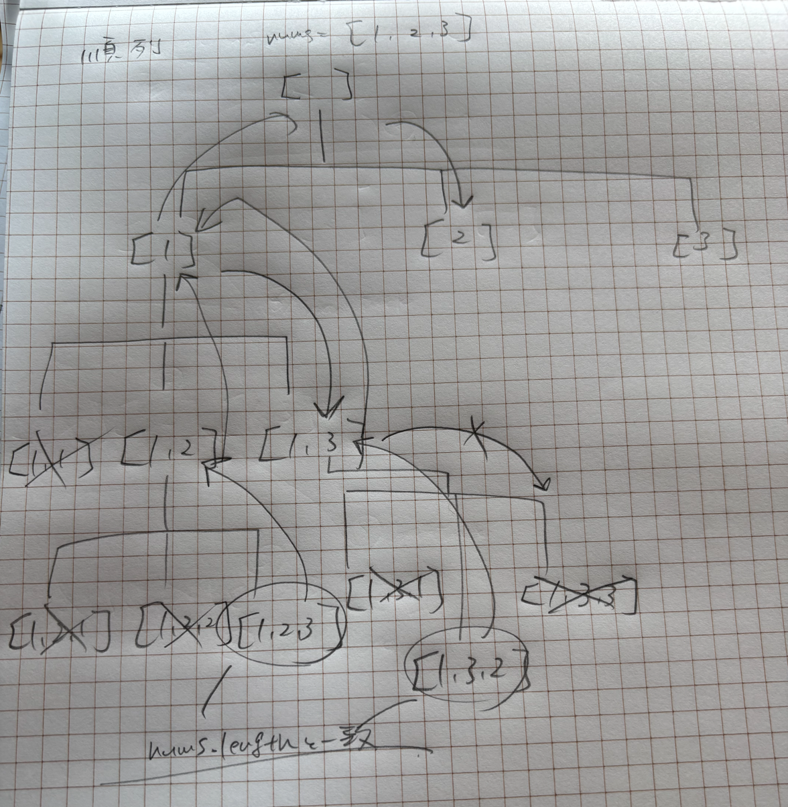
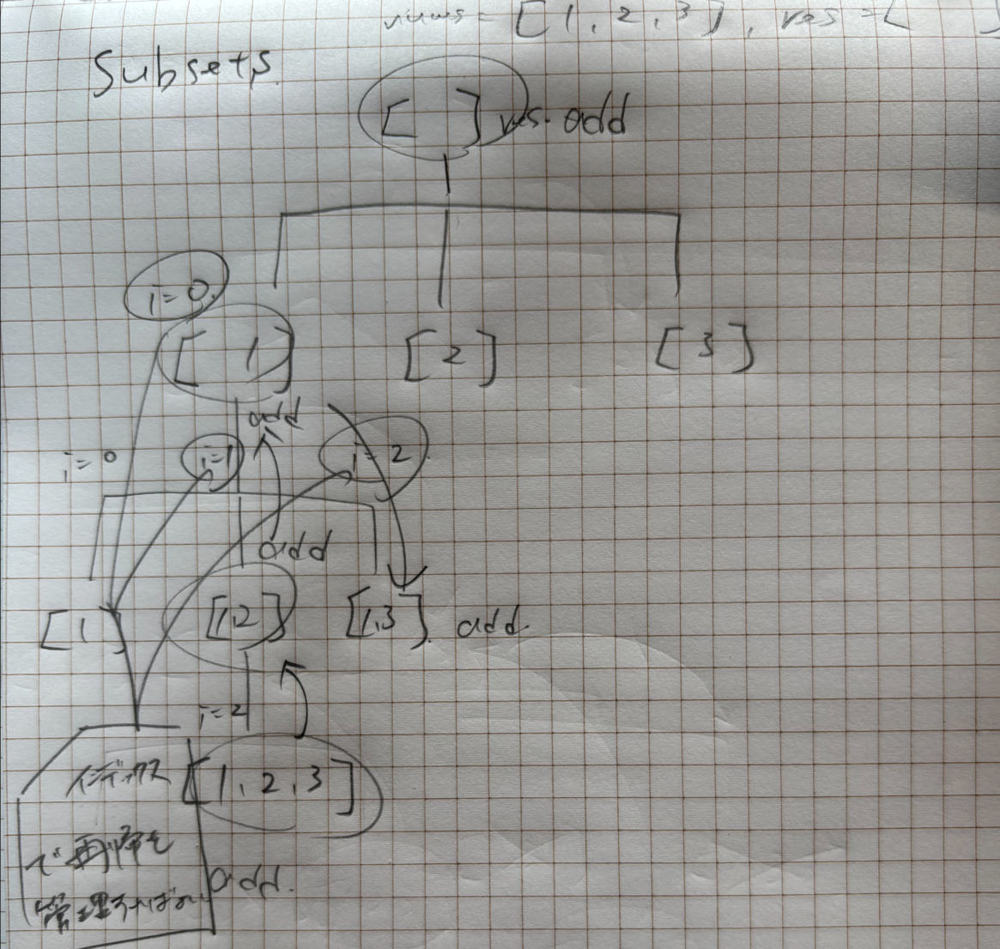

## 1st
- 問題
    - ユニークな int 要素を持つ nums 配列が与えられる
    - nums に含まれる要素の全ての部分集合(空集合を含む)を重複なく列挙して返せ
    - 順序は問わない
- 方針
    - バックトラッキング
    - 初見で、よくわからなかった
    - visited のような boolean 配列を使うのかな？と思ったがそういう眺め方とはちょっと違う
      - 46 permutations との差分は、[1,2] と [2,1] を同一要素と見なすこと
      - permutations は
```markdown
イメージ
        []
    /   |   \
   [1]  [2]  [3]
    |    |    |
  [1,2] [2,3] [3] ...

左から[1],[1,2],[1,2,3] で追加した後にひたすらバックトラックで元に戻っていくイメージ
```
- 実装
```java
class Solution {
    public List<List<Integer>> subsets(int[] nums) {
        List<List<Integer>> result = new ArrayList();
        List<Integer> current = new ArrayList<>();
        dfs(0, nums, current, result);
        return result;
    }

    private void dfs(int index, int[] nums, List<Integer> current, List<List<Integer>> result) {
        // List は参照型なので current の一時コピーを作成
        result.add(new ArrayList<>(current));

        for(int i = index; i < nums.length; i++) {
            current.add(nums[i]);
            dfs(i + 1, nums, current, result);
            current.remove(current.size() - 1);
        }
    }
}
```
- これが見えればいいんちゃう？
  - permutation
    - 
  - subsets
    - 

## 2nd

## 3rd

## 4th

## 5th
