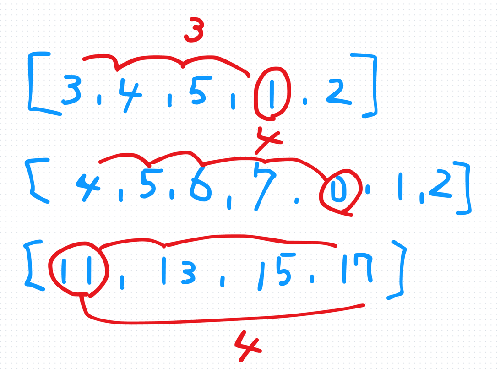
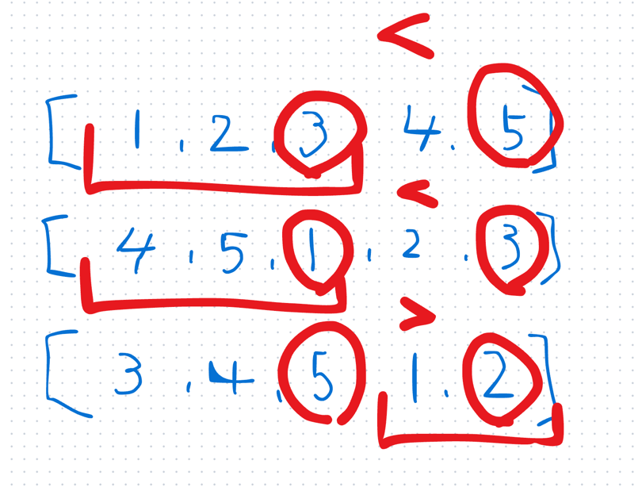
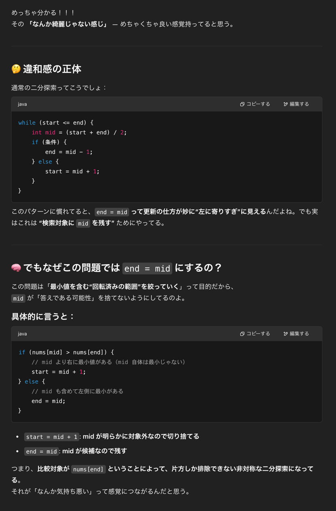
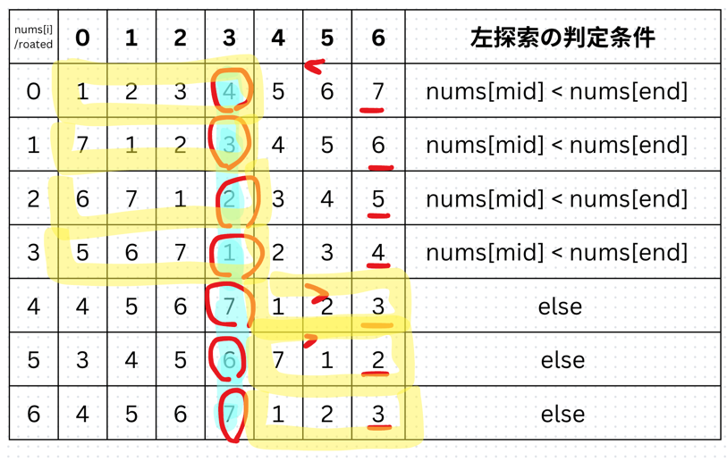

## 1st
- [153. Find Minimum in Rotated Sorted Array](https://leetcode.com/problems/find-minimum-in-rotated-sorted-array/description/)
- 
- k 回ローテションされた昇順ソート済み配列から最小値を見つける問題
- 方針
  - start, middle, end を用意
  - nums[middle], nums[end] を比較して nums[middle] の方が大きければ middle ~ end,
  - そうでなければ start ~ middle に最小値が存在する
  - 
  - どの区間を探索するのか？を考えれば難しくない
  - ⚠️文字列の substring の時と index 管理が違うので、ん？ん？あれ？ってなってしまった
```java
class Solution {
    public int findMin(int[] nums) {
        int start = 0;
        int end   = nums.length - 1;

        while (start < end) {
            int middle = start + (end - start) / 2;
            if (nums[middle] > nums[end]) {
                start = middle + 1;
            } else {
                end = middle;
            }
        }

        return nums[start];
    }
}
```
- 全部書き出してんけど、やっぱり綺麗な BS じゃないよなあというお気持ちなので chatGpt に愚痴を聞いてもらった

## 2nd
- 実装方針

```java
class Solution {
  public int findMin(int[] nums) {
    // 最小値返却問題
    // O(log n) で解け、と言うことなので100%BS
    int start = 0;
    int end = nums.length - 1;

    while (start < end) {
      int middle = start + (end - start) / 2;
      if (nums[middle] < nums[end]) {
        // 左探索
        // end を middleに更新
        end = middle;
      } else {
        // 右探索
        // start を middle + 1 に更新
        start = middle + 1;
      }
    }

    return nums[start];
  }
}
```

## 3rd

## 4th

## 5th
