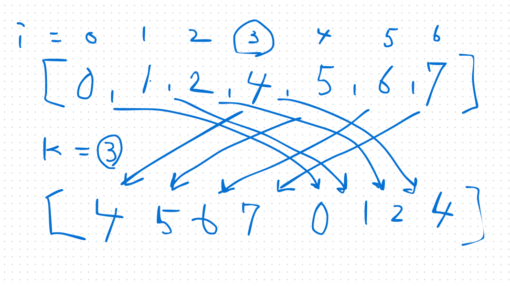

## 1st
- [33. Search in Rotated Sorted Array](https://leetcode.com/problems/search-in-rotated-sorted-array/description/)
- 
- こういう感じで pivot で再度整列された nums と target が与えられる
- ので、nums に target が含まれている場合はそのインデックスを、含まれていない場合は -1 を返す問題
- 方針 
  - 153 っぽい方針を探せばよさそう
  - middle から左右を眺めたときに、どちらかは必ず昇順ソートになっていることを使えばよさそう？
  - 昇順ソートされた範囲内に target が存在するならその範囲を探索すればいい
  - target がないなら、昇順ソートになっていない部分を探索すれば良い
```java
class Solution {
    public int search(int[] nums, int target) {
        int start = 0;
        int end = nums.length - 1;

        while (start <= end) {
            int mid = start + (end - start) / 2;

            // 見つけた！
            if (nums[mid] == target) {
                return mid;
            }

            // 左半分がソートされている場合
            if (nums[start] <= nums[mid]) {
                if (nums[start] <= target && target < nums[mid]) {
                    end = mid - 1; // 左側に target がある
                } else {
                    start = mid + 1; // target は右側にある
                }
            }
            // 右半分がソートされている場合
            else {
                if (nums[mid] < target && target <= nums[end]) {
                    start = mid + 1; // 右側に target がある
                } else {
                    end = mid - 1; // target は左側にある
                }
            }
        }

        // 見つからなかった
        return -1;
    }
}
```

## 2nd

## 3rd

## 4th

## 5th
