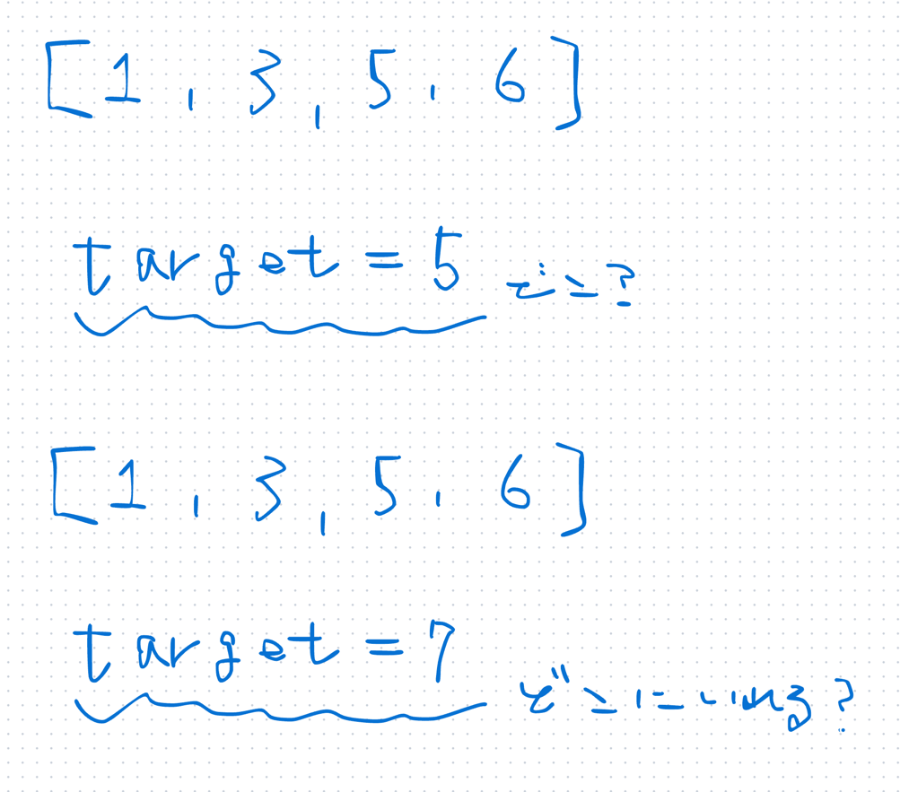

## 1st
- [35. Search Insert Position](https://leetcode.com/problems/search-insert-position/description/)
- 
- まあ流石にね。。

- 方針1
  - 再帰関数を使って、start, end, middle で解く
```java
class Solution {
    public int searchInsert(int[] nums, int target) {
        return searchInsertHelper(nums, 0, nums.length, target);
    }

    private int searchInsertHelper(int[] nums, int start, int end, int target) {
        if (start == end) return start;
        
        int middle = start + (end - start) / 2;
        if (target > nums[middle]) {
            return searchInsertHelper(nums, middle + 1, end, target);
        } else if(target < nums[middle]) {
            return searchInsertHelper(nums, start, middle, target);
        } else {
            return middle;
        }
    }
}
```
- 方針2
  - for ループないし while ループ使って可読性を意識して解く
```java
class Solution {
    public int searchInsert(int[] nums, int target) {
        // BS は、Tree みたいに双方向を探索するわけじゃない
        // ので、シンプルループで書いた方がいいね
        // 再帰でも O(log n) だが、Java では stack overflow を避けてループの方が実務的
        int start = 0;
        int end   = nums.length;
        while (start < end) {
            int middle = start + (end - start) / 2;
            if (target < nums[middle]) {
                end = middle;
            } else if (target > nums[middle]) {
                start = middle + 1;
            } else {
                return middle;
            }
        }

        return start;
    }
}
```

## 2nd

## 3rd

## 4th

## 5th
