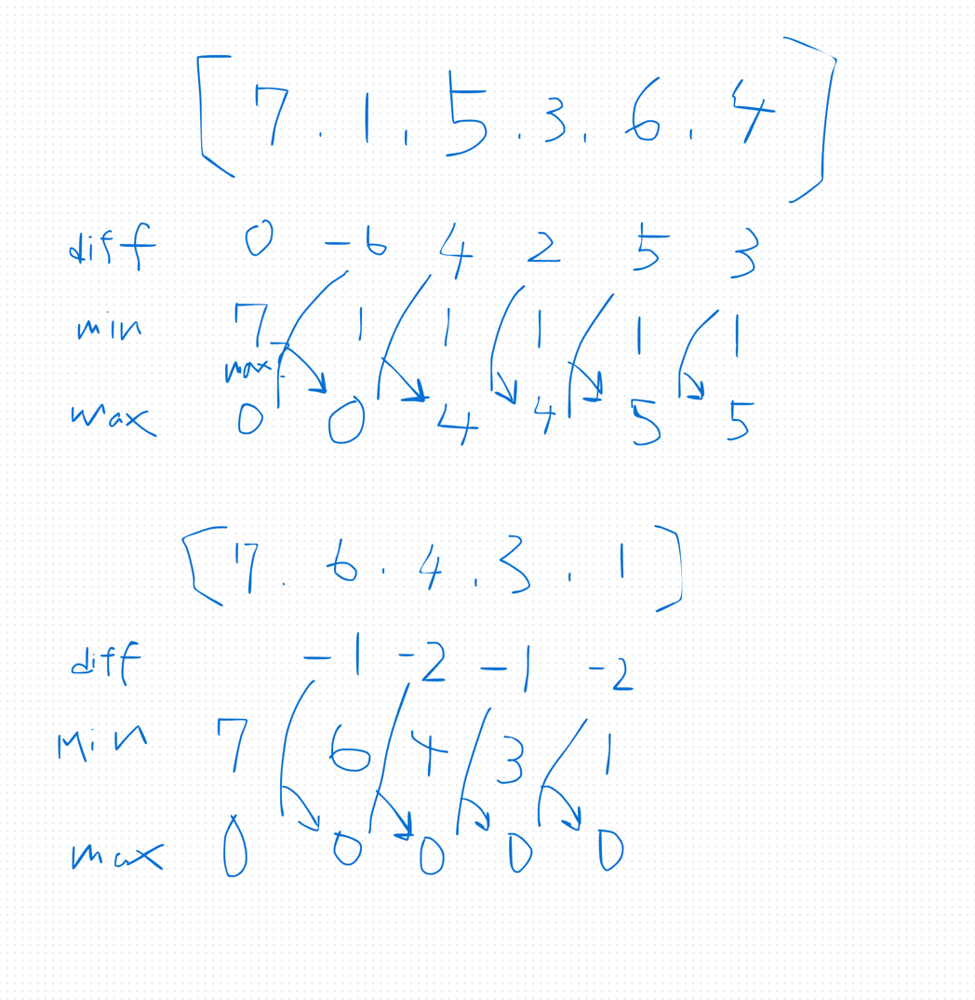

## 1st
- [121. Best Time to Buy and Sell Stock](https://leetcode.com/problems/best-time-to-buy-and-sell-stock/description/)
- 問題
  - 株価を与えるからどの地点で買い売りを一回すれば最大の利益が得られるか？
  - その利益を返せ
- 方針 

```java
class Solution {
    public int maxProfit(int[] prices) {
        int min  = prices[0];
        int max  = 0;

        for (int i = 1; i < prices.length; i++) {
            int diff = prices[i] - min;
            min = Math.min(min, prices[i]);
            max = Math.max(max, diff);
        }
        return max;
    }
}
```
- 時間計算量
  - `O(N)`
- 空間計算量
  - `O(1)`

## 2nd

## 3rd

## 4th

## 5th
