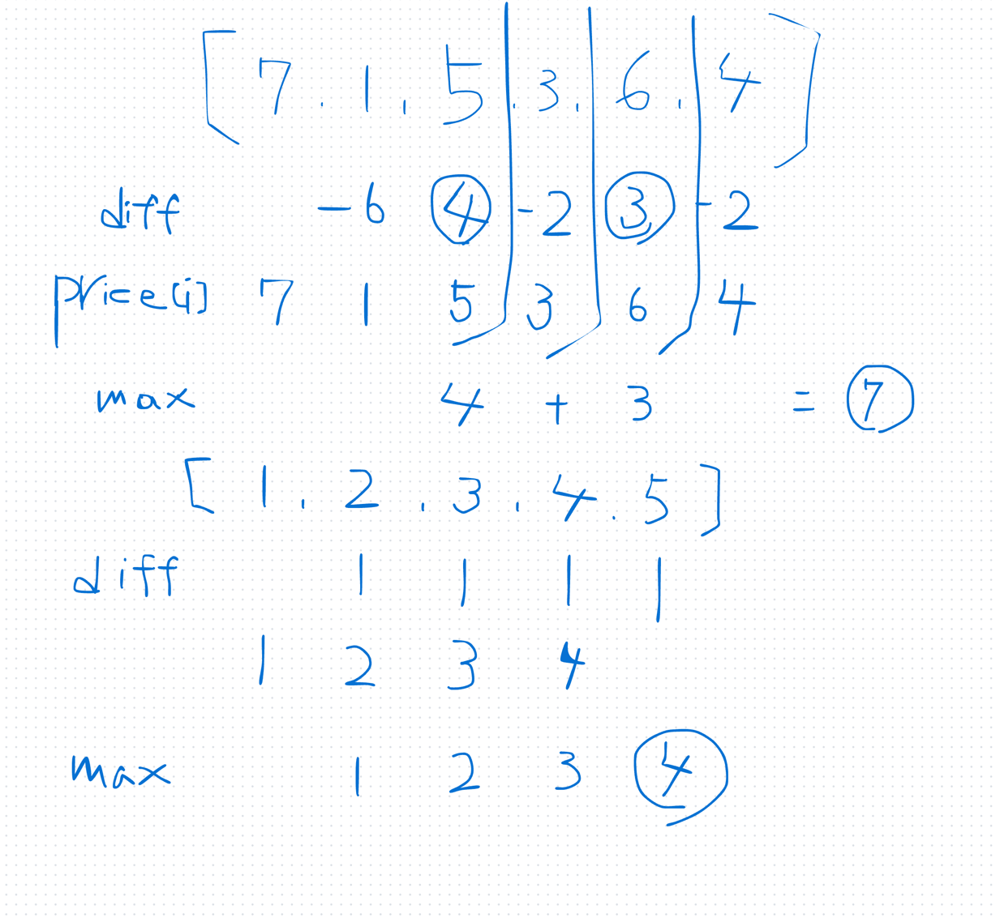
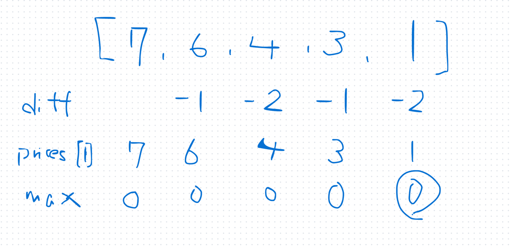

## 1st
- [122. Best Time to Buy and Sell Stock II](https://leetcode.com/problems/best-time-to-buy-and-sell-stock-ii/description/)
- 問題
    - 株価を与える
    - 買う --> 売るは一度ずつしかできない
    - 最大利益を返せ
- 方針
  - DP で解けるが、空間計算量を減らす観点から `Greedy(貪欲法)` っぽく解く方針が最もベターか？
      
      
  - 
```java
class Solution {
    public int maxProfit(int[] prices) {
        int max = 0;
        for (int i = 1; i < prices.length; i++) {
            int diff = prices[i] - prices[i - 1];
            if (diff > 0) max += diff;
        }
        return max;
    }
}
```
- 時間計算量
    - `O(N)`
- 空間計算量
    - `O(1)` DP を使ってメモしていくよりも、計算量が少なく済むね

## 2nd

## 3rd

## 4th

## 5th
