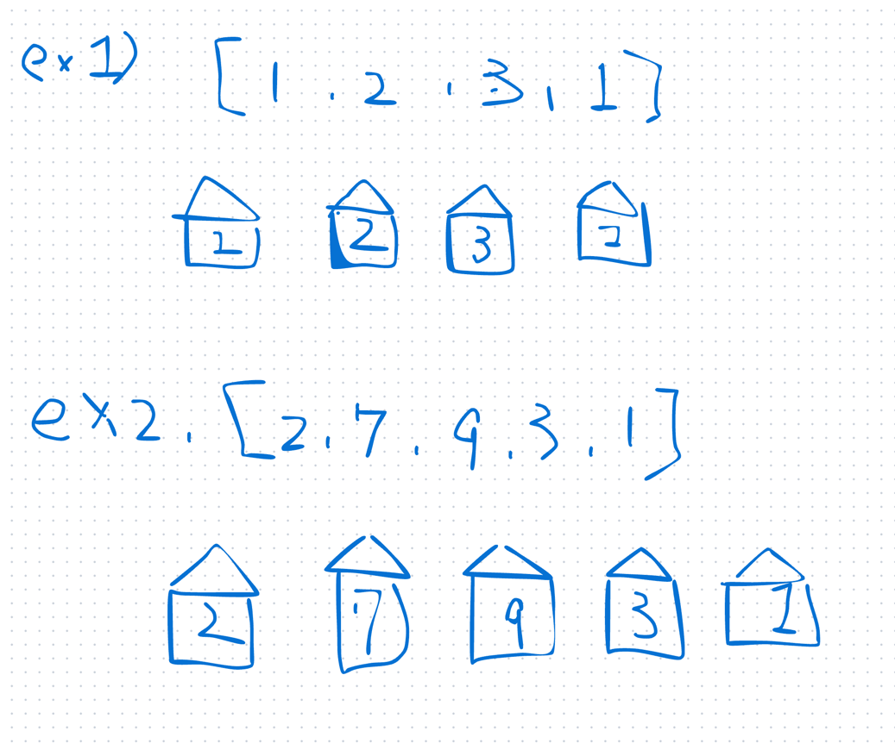
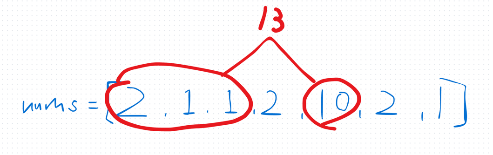
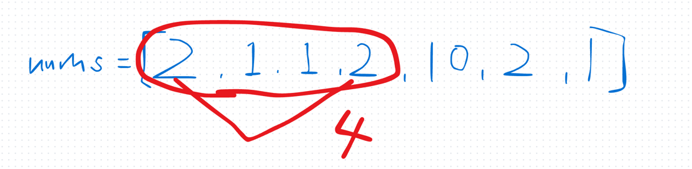
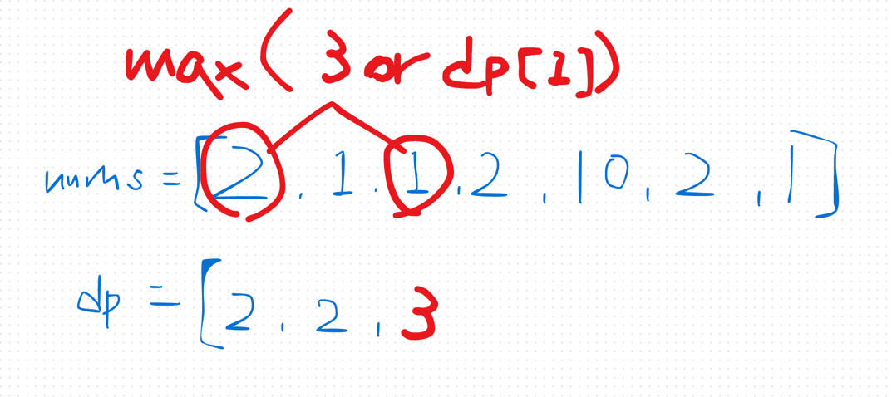
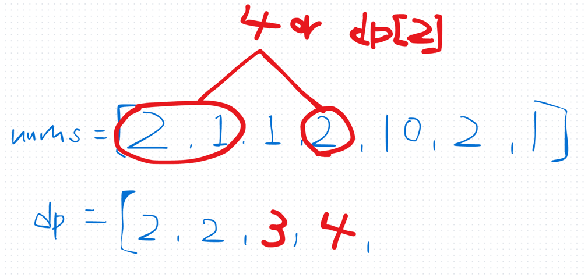
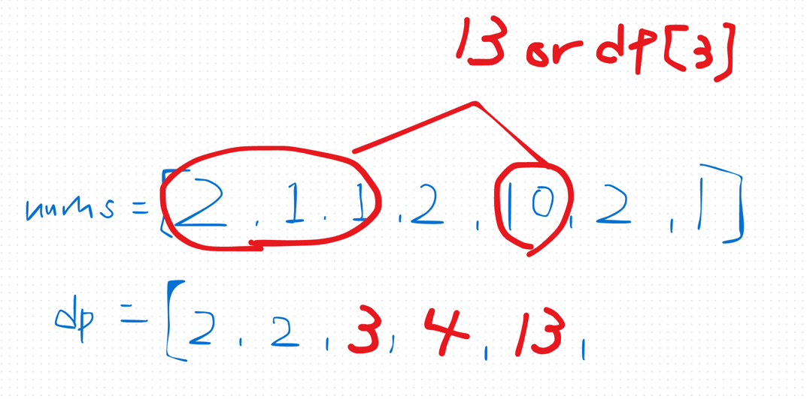
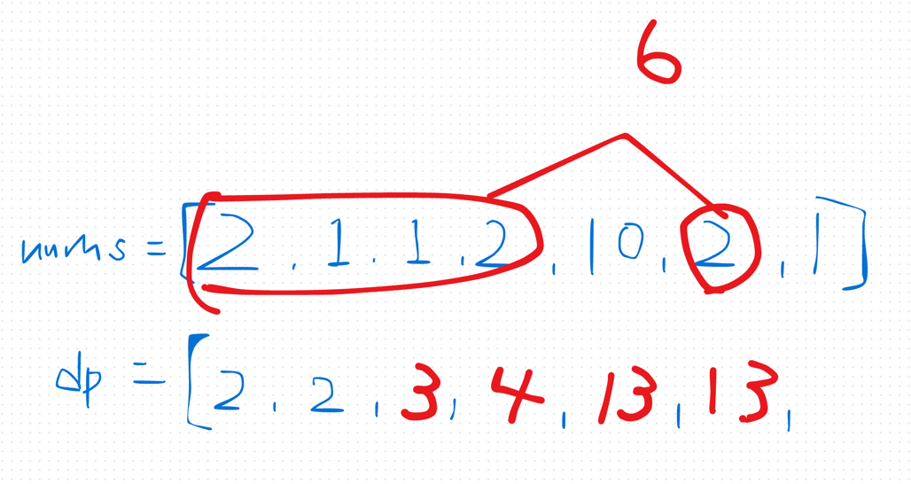
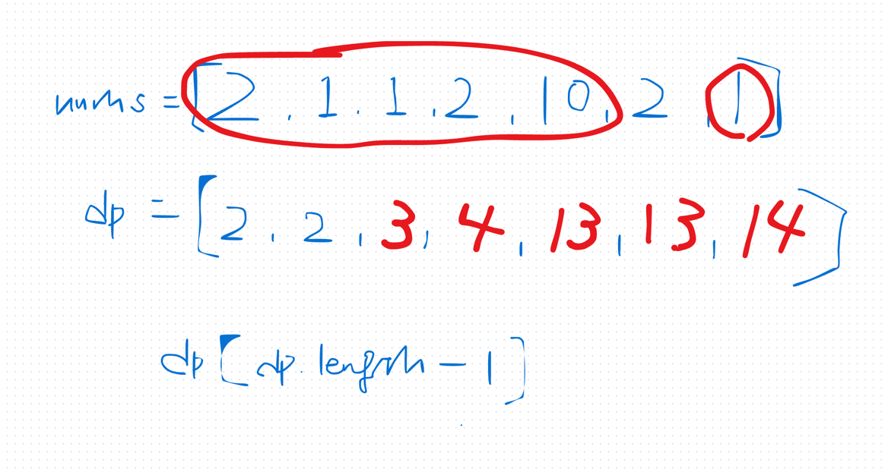

## 1st
- [198. House Robber](https://leetcode.com/problems/house-robber/description/)
- 問題

- 上記のような int[] が与えられるから、最大値を返却せよ
- ただし、隣り合う数字は選択できない
- 方針
  - 多分、dp[] を作るなら dp[i] が常に nums[i] までの最大値になる、みたいに設計すると良さそう
  - けどわからんな、どうすりゃええんだ
  - 例えば nums[4] の時を考えてみる
  - この時 dp[4] は nums[0~2] までの最大値と nums[4] の和、または
  - 
  - nums[0~3] までの間に現れた最大値のどちらか大きい方であれば良い
  - 
  - これをいくつか書き出してみると？
  - 
  - 
  - 
  - 
  - 
  - こういうロジックで良さそう
```java
class Solution {
    public int rob(int[] nums) {
        if (nums.length == 1) return nums[0];

        int[] dp = new int[nums.length];
        dp[0] = nums[0];
        dp[1] = Math.max(nums[0], nums[1]);

        for (int i = 2; i < nums.length; i++) {
            dp[i] = Math.max(dp[i-1], dp[i-2] + nums[i]);
        }

        return dp[nums.length - 1];
    }
}
```
- 時間計算量
  - `O(N)`
- 空間計算量
  - `O(N)`

- 余裕があるので、空間計算量を減らしてみる
- dp の i - 2 以前は常に保持しておく必要はないことに注目すれば良い
```java
class Solution {
    public int rob(int[] nums) {
        if (nums.length == 1) return nums[0];

        int previousMax = nums[0]; 
        int currentMax = Math.max(nums[0], nums[1]);

        for (int i = 2; i < nums.length; i++) {
            int temp = currentMax;
            currentMax = Math.max(currentMax, previousMax + nums[i]);
            previousMax = temp;
        }

        return currentMax;
    }
}
```
- そこまでメモリ使用量がむしろ肥大しているのなぜ。。。？
- 
- 

## 2nd
```java
class Solution {
    public int rob(int[] nums) {
        // dp[i] で i番目までの最大値を記録する
        // 次の家に盗みに入るか？は
        // 前の家に盗みに入った時に得られるコイン数と
        // 前の前の家に盗みに入って盗んだコインと今盗みに入る家のコインの和のうち大きい方を選択すれば良い
        // nums.length が 10^2 だから別に O(N^2)でもいい
        // O(N) で解く
        if (nums.length == 1) return nums[0];

        int[] dp = new int[nums.length];
        dp[0] = nums[0];
        dp[1] = Math.max(nums[0], nums[1]);

        for (int i = 2; i < nums.length; i++) {
            dp[i] = Math.max(dp[i - 2] + nums[i], dp[i - 1]);
        }

        return dp[nums.length - 1];
    }
}
```

## 3rd

## 4th

## 5th
