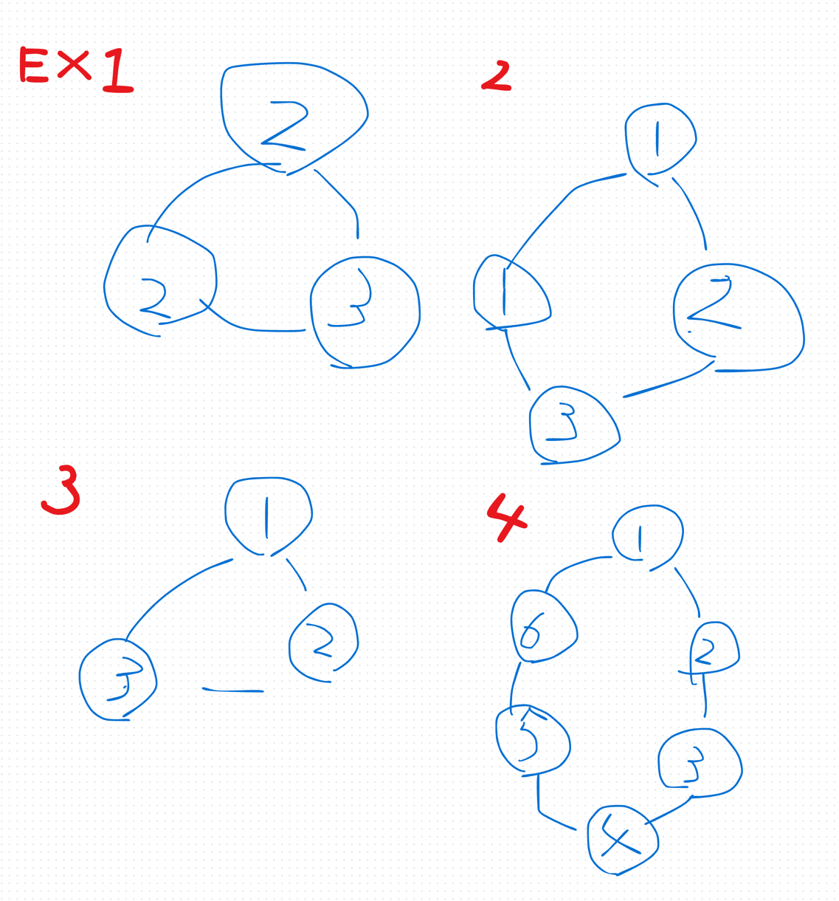
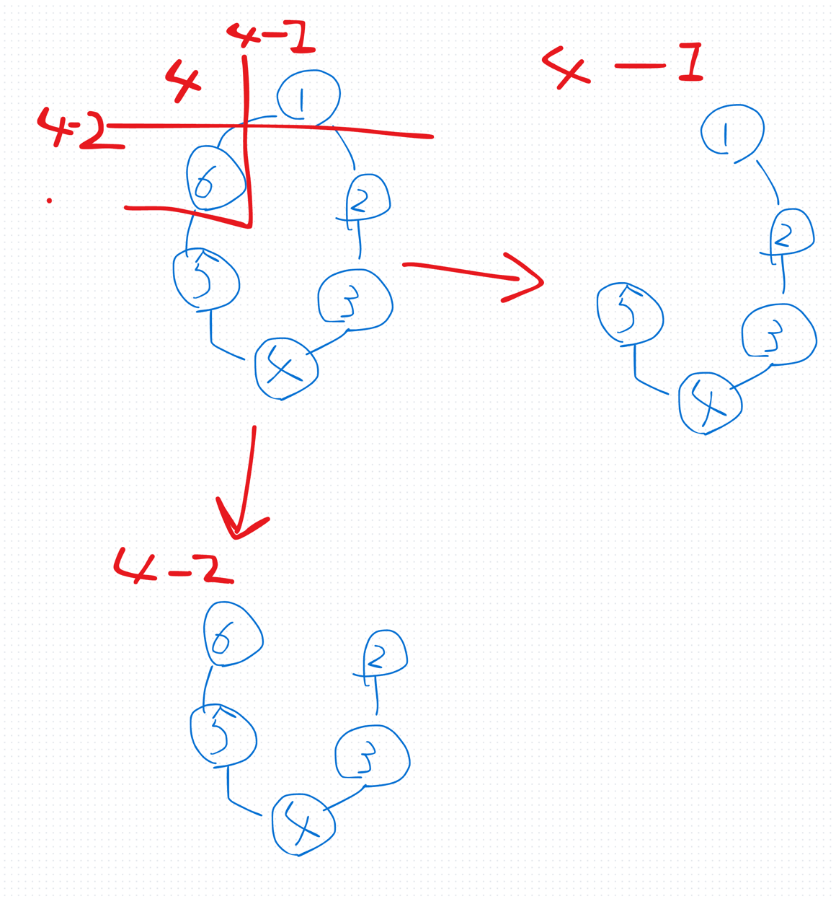
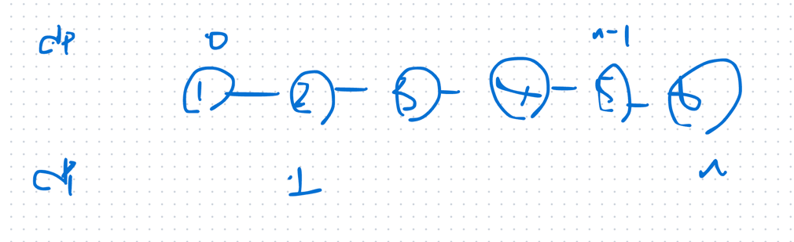

## 1st
- [213. House Robber II](https://leetcode.com/problems/house-robber-ii/description/)
- 
- house Robber I の最初の家と最後の家がつながっている問題
- とはいえ、dp 使ってそれまでの最大和を保持する方針は使えそう
- 終点だけ別処理にすれば良さそう？
  - 
  - この発想でなんとなくあっていて、dp を2つ構築すれば良い
```java
class Solution {
    public int rob(int[] nums) {
        if (nums.length == 1) return nums[0];
        if (nums.length == 2) return Math.max(nums[0], nums[1]);
        // ex. 1,2,3,4,5,6
        
        // 1.2,3,4,5
        int[] excludeLastDp = new int[nums.length - 1];
        excludeLastDp[0] = nums[0];
        excludeLastDp[1] = Math.max(nums[0], nums[1]);

        for (int i = 2; i < nums.length - 1; i++) {
            excludeLastDp[i] = Math.max(excludeLastDp[i-1], excludeLastDp[i-2] + nums[i]);
        }

        // 2,3,4,5,6
        int[] excludeFirstDp = new int[nums.length - 1];
        excludeFirstDp[0] = nums[1];
        excludeFirstDp[1] = Math.max(nums[1], nums[2]);

        for (int i = 2, j = 3; j < nums.length; i++, j++) {
            excludeFirstDp[i] = Math.max(excludeFirstDp[i-1], excludeFirstDp[i-2] + nums[j]);
        }

        return Math.max(excludeLastDp[excludeLastDp.length - 1], excludeFirstDp[excludeFirstDp.length - 1]);
    }
}
```
- 通ったけど次回綺麗にしたい
  - 同じような rob 処理をやっているところを別関数として切り出したい
  - dp[] 配列を無理に使わずに、previous, current に分けてそっちに保存するようにしたいな

- 時間計算量
  - `O(N)`
- 空間計算量
  - `O(N)`

## 2nd
- 方針
  - 
  - より綺麗にするため、線形探索処理を別関数に切り出した
  - nums[0], nums[nums.length - 1] 要素の締め出し処理は、別関数の中の線形走査時に nums を探索する処理で工夫している
```java
class Solution {
    public int rob(int[] nums) {
        int length = nums.length;
        if (length == 1) return nums[0];
        if (length == 2) return Math.max(nums[0], nums[1]);
        return Math.max(
            robLinear(nums, 0, nums.length - 2),
            robLinear(nums, 1, nums.length - 1)
        );
    }

    private int robLinear(int[] nums, int start, int end) {
        int n = end - start + 1;
        if (n == 1) return nums[start];
        int[] dp = new int[n];
        dp[0] = nums[start];
        dp[1] = Math.max(nums[start], nums[start + 1]);
        for (int i = 2; i < n; i++) {
            dp[i] = Math.max(dp[i - 1], dp[i - 2] + nums[i + start]);
        }

        return dp[n - 1];
    }
}
```

## 3rd

## 4th

## 5th
