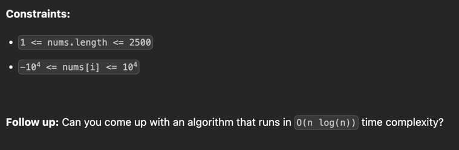
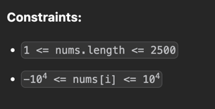

# 1st
- [最長増加部分列問題](https://www.geeksforgeeks.org/longest-increasing-subsequence-dp-3/)
- Given an integer array nums, return the length of the longest strictly increasing subsequence.
- int[] をあたえる、このサブシーケンスの中で厳密に増加している要素の長さを返せ.と言う問題
```text
Constraints:
1 <= nums.length <= 2500
-10^4 <= nums[i] <= 10^4
```
- フォローアップで O(N log N) で解いてみろと言っている
- そもそも Dynamic Programming ってなんやねんと言うことで、単純なO(N^2)で方針を立ててみる
### 方針1 O(N^2)
- 普通に方針立たなかったんで chatGpt にぶん投げてみた
```
nums = [10,  9,  2,  5,  3,  7, 101, 18]
dp   = [ 1,  1,  1,  1,  1,  1,   1,  1]  // 最初は全部「単独で1」

for i in 0..n-1:
    for j in 0..i-1:
        if nums[j] < nums[i]:
            dp[i] = max(dp[i], dp[j] + 1)

nums = [10,  9,  2,  5,  3,  7, 101, 18]
dp   = [ 1,  1,  1,  2,  2,  3,   4,  4]
```
- これ実際に手書きするとこうなっていて、理にかなっている


- とはいえ、上記の方法でやると計算量が O(N^2) が確定してしまうので、もっと効率よくやりましょうと言うお話
- O(N log N) のアプローチ（「DPの形をしたBinary Search」）
- DP配列 dp を「単調増加を保つ最小構成」とみなす。
  - 処理手順（各 num に対して）：
  - num を dp に挿入する位置を 二分探索 で見つける（lower_bound） 
  - その位置に num を「上書き」する（より小さい末尾で代替） 
  - dp の長さが LIS の長さとなる 
    - 例：[10,9,2,5,3,7,101,18]
      - 10 → dp = [10]
      - 9 → dp = [9]（10 を置換） 
      - 2 → dp = [2]
      - 5 → dp = [2,5]
      - 3 → dp = [2,3]
      - 7 → dp = [2,3,7]
      - 101 → dp = [2,3,7,101]
      - 18 → dp = [2,3,7,18]（101 を置換） 
      - → 最終的な長さ：4
```java
class Solution {
    public int lengthOfLIS(int[] nums) {
        int[] dp = new int[nums.length];
        Arrays.fill(dp, 1); // 全ての要素1埋め

        for (int i = 0; i < nums.length; i++) {
            for (int j = 0; j < i; j++) {
                if (nums[j] < nums[i]) {
                    dp[i] = Math.max(dp[i], dp[j] + 1);
                }
            }
        }

        return Arrays.stream(dp).max().getAsInt();
    }
}
```
### 方針2 O(n log N)
- 方針2-1
  - Java Array の `binarySearch` メソッドを使う方法
```java
import java.util.Arrays;

public class Solution {
    public int lengthOfLIS(int[] nums) {
        int[] dp = new int[nums.length];
        int size = 0;

        for (int num : nums) {
            // 二分探索で挿入位置を見つける
            int i = Arrays.binarySearch(dp, 0, size, num);

            // 挿入位置が負ならその位置にnumを入れる（末尾更新）
            if (i < 0) i = -(i + 1);

            dp[i] = num;

            // 新しい要素が末尾に追加されたなら size を増やす
            if (i == size) size++;
        }

        return size;
    }
}
```
- いやこれ書けてもなんの勉強にもならへんわ
- 方針2-2 
  - 自分で binarySearch っぽいメソッドを自作する
```java
class Solution {
    public int lengthOfLIS(int[] nums) {
        int[] dp = new int[nums.length];
        int size = 0;

        for (int num : nums) {
            int i = lowerBound(dp, 0, size, num);
            dp[i] = num;
            if (i == size) size++;
        }

        return size;
    }

    private int lowerBound(int[] dp, int left, int right, int target) {
        while (left < right) {
            int mid = left + (right - left) / 2;
            if (dp[mid] < target) {
                left = mid + 1;
            } else {
                right = mid;
            }
        }
        return left;
    }
}
```
| num | dp の状態                       | i (挿入位置) | 更新後の dp                     | size |
| --- | ---------------------------- | -------- | --------------------------- | ---- |
| 10  | \[ \_ \_ \_ \_ \_ \_ \_ \_ ] | 0        | \[10 \_ \_ \_ \_ \_ \_ \_ ] | 1    |
| 9   | \[10 \_ \_ \_ \_ \_ \_ \_ ]  | 0        | \[9 \_ \_ \_ \_ \_ \_ \_ ]  | 1    |
| 2   | \[9 \_ \_ \_ \_ \_ \_ \_ ]   | 0        | \[2 \_ \_ \_ \_ \_ \_ \_ ]  | 1    |
| 5   | \[2 \_ \_ \_ \_ \_ \_ \_ ]   | 1        | \[2 5 \_ \_ \_ \_ \_ \_ ]   | 2    |
| 3   | \[2 5 \_ \_ \_ \_ \_ \_ ]    | 1        | \[2 3 \_ \_ \_ \_ \_ \_ ]   | 2    |
| 7   | \[2 3 \_ \_ \_ \_ \_ \_ ]    | 2        | \[2 3 7 \_ \_ \_ \_ \_ ]    | 3    |
| 101 | \[2 3 7 \_ \_ \_ \_ \_ ]     | 3        | \[2 3 7 101 \_ \_ \_ \_ ]   | 4    |
| 18  | \[2 3 7 101 \_ \_ \_ \_ ]    | 3        | \[2 3 7 18 \_ \_ \_ \_ ]    | 4    |

- 時間計算量
  - `O(N * logN)`
- 空間計算量
  - `O(N)`

# 2nd
- 5/17 13:19 ~ 13:47
- 時間 30分
- 方針
  - 
  - 制約から、O(n logn)で解けと言われているが
  - dp[i] は常に nums[i] 番目までの strictly increasing 数を記録する方針を立ててみると、O(N) で解けるような気がした
  - これで実装してみる
- 結果
  - Ex は AC するが submit で AC せず... 
    - Ex のケースが通ったからって安心するだけじゃダメで、テストケースを自分で想定することが大事。。 
    - 回答方針として、データ量から計算量的に大丈夫なものがいくつかある場合は可読性や実装難易度を見積もってコードインタビューを受ける際に最適なものを選択し、
    - その上でテストケースを網羅的に並べ、それを満たすプログラムを書くことが求められていることを強く意識しないといけないな 
    - 今回の見落としては、non-unique な値が nums[i] に存在した時に、dp[i] に dp[i-1] をコピーしてしまうこと
```java
class Solution {
    public int lengthOfLIS(int[] nums) {
        int[] dp = new int[nums.length];
        Arrays.fill(dp, 1);
        // dp[i] は常に nums[i] 番目までの strictly increasing 数を記録する
        // [4, 10, 4, 3, 8, 9] で詰む
        for (int i = 1; i < nums.length; i++) {
            if (nums[i] > nums[i - 1]) {
                dp[i] = Math.max(dp[i], dp[i - 1] + 1);
            } else {
                dp[i] = dp[i - 1];
            }
        }
        return dp[nums.length - 1];
    }
}
```
- どうにかできないか考えてみて、無理なら回答みる
- 5/17 14:30 ~
- 回答みたけど、フォローアップに従えば、確かに BS を使う問題だしその通りに解けばそうなるか。。というお気持ち
- 今回は O(N^2) でも、最悪計算量が 9 * 10^6 なので許される
```java
/// dp っぽく、O(N^2)
class Solution {
  public int lengthOfLIS(int[] nums) {
    int[] dp = new int[nums.length];
    Arrays.fill(dp, 1);

    for (int i = 1; i < nums.length; i++) {
      for (int j = 0; j < i; j++) {
        if (nums[i] > nums[j]) {
          dp[i] = Math.max(dp[j] + 1, dp[i]);
        }
      }
    }

    int max = 0;
    for (int candidate : dp) {
      max = Math.max(max, candidate);
    }

    return max;
  }
}
```
- BS を使うのは O(N^2) が当たり前に書けるようになってからでいいや

# 3rd
- 苦手なので復習
- ⚠️ 比較をするときに、dp と nums を間違える癖があるので注意
- 厳密に増加しているサブシーケンスの個数を探す問題
- 
- dp[i] に nums[i]番目までの厳密増加サブシーケンス数を記録する方針
- dp[] のなかのどこかに最大値があるので O(N) で線形走査して最大値を探す必要があるのが厄介
- O(N^2) で一旦 TLE しない程度のインプットなので、まずこちらの方針で書けるようにする
```java
class Solution {
    public int lengthOfLIS(int[] nums) {
        int[] dp = new int[nums.length];
        Arrays.fill(dp, 1);
      
        for (int i = 1; i < nums.length; i++) {
            for (int j = 0; j < i; j++) {
                if (nums[j] < nums[i]) {
                    dp[i] = Math.max(dp[i], dp[j] + 1);
                }
            }
        }

        int max = 0;
        for (int candidate : dp) {
            max = Math.max(max, candidate);
        }

        return max;
    }
}
```

- O(n log(n)) で書く方針を試してみる
  1. `dp[nums.length]` を用意
  2. nums を for で回していく
  3. 最長配列になる可能性を追い求めて dp を置換していく
  4. それまでの最大配列長は記録済みだから別に置き換えて良い
- 特に、最初にそこそこの長さの厳密増加部分配列が存在した後に、その長さを超えるサブシーケンスがあった場合の挙動を chatGpt に書かせてみた
```text
初期状態：
  dp: []

1. num = 3
  dp: [3]       ← append
           └── 3

2. num = 10
  dp: [3,10]    ← append
           └── 3
                └── 10

3. num = 11
  dp: [3,10,11] ← append
           └── 3
                └── 10
                     └── 11

4. num = 20
  dp: [3,10,11,20] ← append
           └── 3
                └── 10
                     └── 11
                          └── 20

5. num = 1
  dp: [1,10,11,20] ← 3 → 1 に置換
           └── 1
                └── 10
                     └── 11
                          └── 20

6. num = 2
  dp: [1,2,11,20] ← 10 → 2 に置換
           └── 1
                └── 2
                     └── 11
                          └── 20

7. num = 4
  dp: [1,2,4,20] ← 11 → 4 に置換
           └── 1
                └── 2
                     └── 4
                          └── 20

8. num = 5
  dp: [1,2,4,5] ← 20 → 5 に置換
           └── 1
                └── 2
                     └── 4
                          └── 5

9. num = 6
  dp: [1,2,4,5,6] ← append
           └── 1
                └── 2
                     └── 4
                          └── 5
                               └── 6

10. num = 7
  dp: [1,2,4,5,6,7] ← append
           └── 1
                └── 2
                     └── 4
                          └── 5
                               └── 6
                                    └── 7

```
```java
class Solution {
    public int lengthOfLIS(int[] nums) {
        // BS 的なアプローチで解く
        int[] dp = new int[nums.length];
        int size = 0;

        for (int num : nums) {
            int i = upperBounds(dp, 0, size, num);
            dp[i] = num;
            if (i == size) size++;
        }

        return size;
    }

    private int upperBounds(int[] dp, int start, int end, int num) {
        while (start < end) {
            int middle = start + (end - start) / 2;

            if (dp[middle] < num) {
                // 右探索
                start = middle + 1;
            } else {
                // 左探索
                end = middle;
            }
        }

        return start;
    }
}
```

# 4th

# 5th
