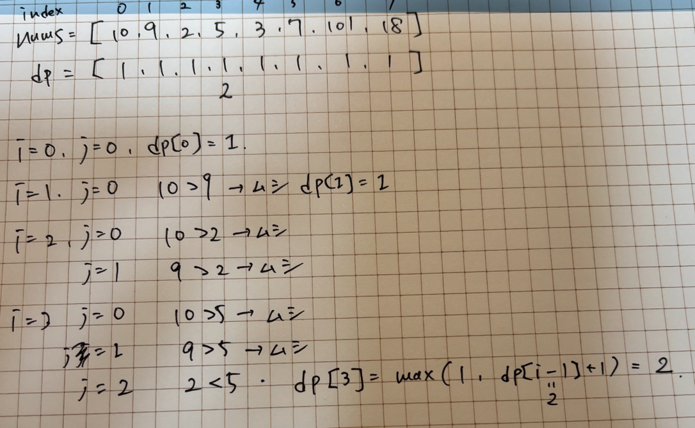
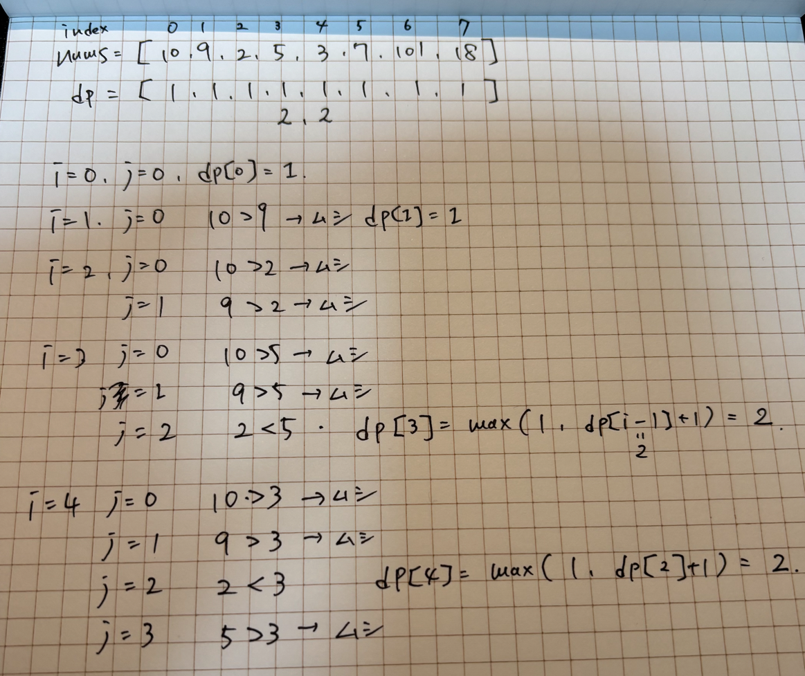
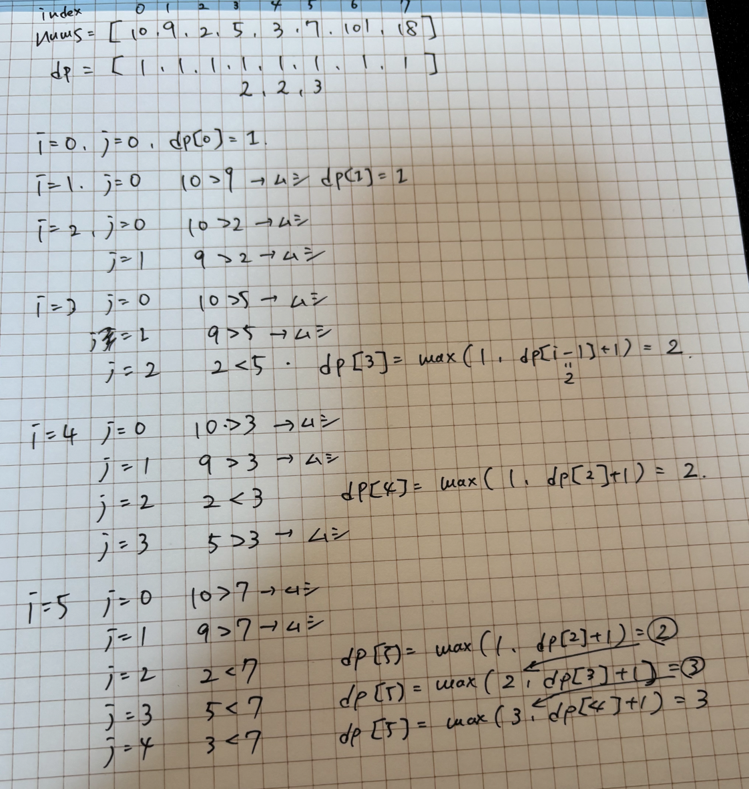
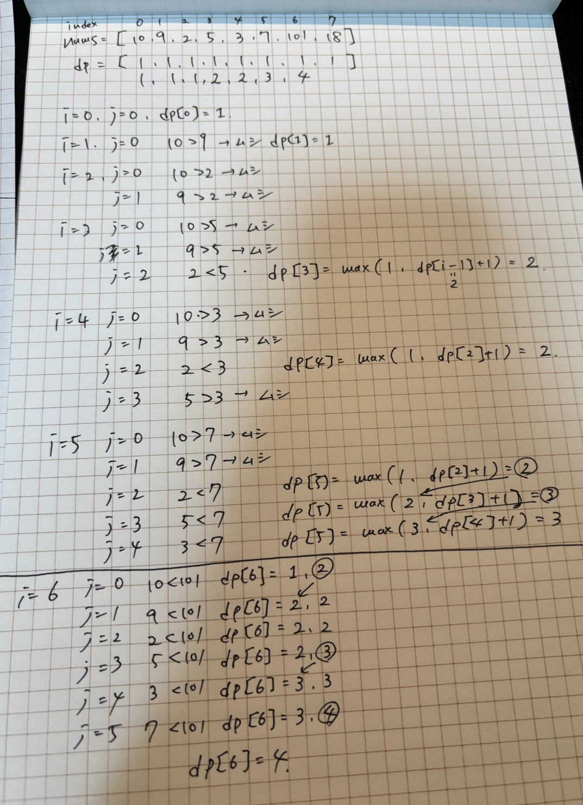
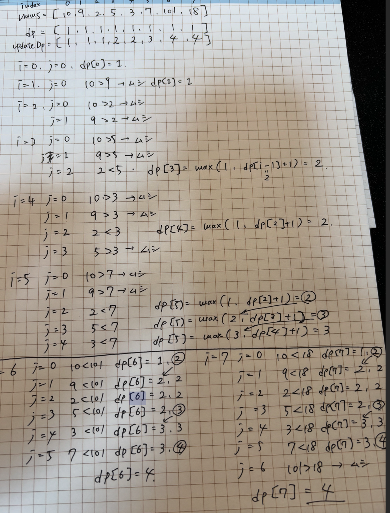

# 1st
- Given an integer array nums, return the length of the longest strictly increasing subsequence.
- int[] をあたえる、このサブシーケンスの中で厳密に増加している要素の長さを返せ.と言う問題
```text
Constraints:
1 <= nums.length <= 2500
-10^4 <= nums[i] <= 10^4
```
- フォローアップで O(N log N) で解いてみろと言っている
- そもそも Dynamic Programming ってなんやねんと言うことで、単純なO(N^2)で方針を立ててみる
### 方針1 O(N^2)
- 普通に方針立たなかったんで chatGpt にぶん投げてみた
```
nums = [10,  9,  2,  5,  3,  7, 101, 18]
dp   = [ 1,  1,  1,  1,  1,  1,   1,  1]  // 最初は全部「単独で1」

for i in 0..n-1:
    for j in 0..i-1:
        if nums[j] < nums[i]:
            dp[i] = max(dp[i], dp[j] + 1)

nums = [10,  9,  2,  5,  3,  7, 101, 18]
dp   = [ 1,  1,  1,  2,  2,  3,   4,  4]
```
- これ実際に手書きするとこうなっていて、理にかなっている





- とはいえ、上記の方法でやると計算量が O(N^2) が確定してしまうので、もっと効率よくやりましょうと言うお話
- O(N log N) のアプローチ（「DPの形をしたBinary Search」）
- DP配列 dp を「単調増加を保つ最小構成」とみなす。
  - 処理手順（各 num に対して）：
  - num を dp に挿入する位置を 二分探索 で見つける（lower_bound） 
  - その位置に num を「上書き」する（より小さい末尾で代替） 
  - dp の長さが LIS の長さとなる 
    - 例：[10,9,2,5,3,7,101,18]
      - 10 → dp = [10]
      - 9 → dp = [9]（10 を置換） 
      - 2 → dp = [2]
      - 5 → dp = [2,5]
      - 3 → dp = [2,3]
      - 7 → dp = [2,3,7]
      - 101 → dp = [2,3,7,101]
      - 18 → dp = [2,3,7,18]（101 を置換） 
      - → 最終的な長さ：4
```java
class Solution {
    public int lengthOfLIS(int[] nums) {
        int[] dp = new int[nums.length];
        Arrays.fill(dp, 1); // 全ての要素1埋め

        for (int i = 0; i < nums.length; i++) {
            for (int j = 0; j < i; j++) {
                if (nums[j] < nums[i]) {
                    dp[i] = Math.max(dp[i], dp[j] + 1);
                }
            }
        }

        return Arrays.stream(dp).max().getAsInt();
    }
}
```
### 方針2 O(n log N)
- 方針2-1
  - Java Array の `binarySearch` メソッドを使う方法
```java
import java.util.Arrays;

public class Solution {
    public int lengthOfLIS(int[] nums) {
        int[] dp = new int[nums.length];
        int size = 0;

        for (int num : nums) {
            // 二分探索で挿入位置を見つける
            int i = Arrays.binarySearch(dp, 0, size, num);

            // 挿入位置が負ならその位置にnumを入れる（末尾更新）
            if (i < 0) i = -(i + 1);

            dp[i] = num;

            // 新しい要素が末尾に追加されたなら size を増やす
            if (i == size) size++;
        }

        return size;
    }
}
```
- いやこれ書けてもなんの勉強にもならへんわ
- 方針2-2 
  - 自分で binarySearch っぽいメソッドを自作する
```java
class Solution {
    public int lengthOfLIS(int[] nums) {
        int[] dp = new int[nums.length];
        int size = 0;

        for (int num : nums) {
            int i = lowerBound(dp, 0, size, num);
            dp[i] = num;
            if (i == size) size++;
        }

        return size;
    }

    private int lowerBound(int[] dp, int left, int right, int target) {
        while (left < right) {
            int mid = left + (right - left) / 2;
            if (dp[mid] < target) {
                left = mid + 1;
            } else {
                right = mid;
            }
        }
        return left;
    }
}
```
| num | dp の状態                       | i (挿入位置) | 更新後の dp                     | size |
| --- | ---------------------------- | -------- | --------------------------- | ---- |
| 10  | \[ \_ \_ \_ \_ \_ \_ \_ \_ ] | 0        | \[10 \_ \_ \_ \_ \_ \_ \_ ] | 1    |
| 9   | \[10 \_ \_ \_ \_ \_ \_ \_ ]  | 0        | \[9 \_ \_ \_ \_ \_ \_ \_ ]  | 1    |
| 2   | \[9 \_ \_ \_ \_ \_ \_ \_ ]   | 0        | \[2 \_ \_ \_ \_ \_ \_ \_ ]  | 1    |
| 5   | \[2 \_ \_ \_ \_ \_ \_ \_ ]   | 1        | \[2 5 \_ \_ \_ \_ \_ \_ ]   | 2    |
| 3   | \[2 5 \_ \_ \_ \_ \_ \_ ]    | 1        | \[2 3 \_ \_ \_ \_ \_ \_ ]   | 2    |
| 7   | \[2 3 \_ \_ \_ \_ \_ \_ ]    | 2        | \[2 3 7 \_ \_ \_ \_ \_ ]    | 3    |
| 101 | \[2 3 7 \_ \_ \_ \_ \_ ]     | 3        | \[2 3 7 101 \_ \_ \_ \_ ]   | 4    |
| 18  | \[2 3 7 101 \_ \_ \_ \_ ]    | 3        | \[2 3 7 18 \_ \_ \_ \_ ]    | 4    |

- 時間計算量
  - `O(N * logN)`
- 空間計算量
  - `O(N)`

# 2nd

# 3rd

# 4th

# 5th
