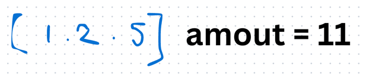

## 1st
- [322. Coin Change](https://leetcode.com/problems/coin-change/description/)
- 
- target を満たすコインの和の組み合わせ最小値を求めて返却する問題
  - 方針
    - `[11 - 1, 11 - 2, 11 - 5]` のように amount からそれぞれのコインの数を引いたものをリストとして作り、
    - 0 になったら即終了という DFS の発想で組もうと思ったが。。
    - wordBreak の時の `[aaaaaaaaaaaab], [a,aa,aaa,aaaa]` の時と同様に b に辿り着くまでに異常な数の計算をしないといけないため確実に TLE する
    - 同様の例を考えてみると、`coins = [1,1,1,1,1,1,1,1,1,1,1], amount = 10^4` の時、無駄な計算処理が走りまくるのはよろしくない
  - じゃあどうする？
    - dp 的発想の、すでに出た金額の答えを保存する
    - dp を dp[i] = i 円を作るまでの最小コイン数として記録していく
```java
class Solution {
    public int coinChange(int[] coins, int amount) {
        int[] dp = new int[amount + 1];
        Arrays.fill(dp, Integer.MAX_VALUE);
        dp[0] = 0;

        for (int i = 1; i <= amount; i++) {
            for (int coin : coins) {
                // i - coin >= 0 は、dp[] の index out of bound を防ぐため
                // dp[i - coin] != Integer.MAX_VALUE は、そもそも i - coin 円を構成する最小枚数が記録されているかどうかの確認するため
                if (i - coin >= 0 && dp[i - coin] != Integer.MAX_VALUE) {
                    // Math.min を初見で入れるのは絵を描いてからじゃないと無理かな。。
                    // i - coin の発想に至るまでに1ステップ必要
                    dp[i] = Math.min(dp[i], dp[i - coin] + 1);
                }
            }
        }

        if (dp[amount] == Integer.MAX_VALUE) return -1;
        return dp[amount];
    }
}
```
- 時間計算量
  - dp[i]円を構成する最小枚数で考えると、`O(coins.length * amount)` になる
- 空間計算量
  - `O(amount)`

## 2nd
- 5/23 16:55 ~ 17:10
- AC せず、計算量的にもアウト
```java
class Solution {
    public int coinChange(int[] coins, int amount) {
        // 方針
        // 早期リターン条件 
        // amount が 0 の場合は構成できないので dp[0] を返却する
        if (amount == 0) return 0;

        // coins.length 12 が最悪なので、コインについては6重ループとか作らなければ問題ない
        // coins.length の数で N^2 で回したりしても特に問題はないな
        // これも解いてから時間が経っていないので dp 的な解法をすぐ思いつけてしまうんだよなあ。。。。。
        // 無限にコインを持っていると仮定して良いので、dp[i] を i 円を作るために必要な最小コイン数として記録していけば良さそう
        // amout の数分の int[] を用意
        int[] dp = new int[amount]; // ⚠️amount + 1 分用意する必要がある
        Arrays.fill(dp, Integer.MAX_VALUE);
        dp[0] = 0;


        // i 円作るのに必要な最小枚数を記録する
        for (int i = 1; i < amount; i++) { // ⚠️ amount まで i は回す
            // dp[i]円作るのにちょうど必要な枚数があれば必ず1枚になる
            for (int coin : coins) {
                if (i == coin) {
                    dp[i] = 1;
                    break;
                } 

                // 過去の dp[1 ~ i - 1] 円までの最小枚数に coin を足して amount になる場合は、その枚数 + 1
                for (int j = 1; j < i; j++) {
                    if (i == dp[j] + coin) {
                        dp[i] = Math.min(dp[i], dp[j] + 1);
                    }
                }
            }
        }

        int k = 0;
        for (int dp_i : dp) {
            System.out.print("dp" + "_" + k + ": " + dp_i + ", ");
            k++;
        }
        
        if (dp[amount - 1] == 0) return -1;
        return dp[amount - 1];
    }
}
```
- chatgpt からのお叱りポイント
```markdown
| ✅ | 内容                                                |
| - | ------------------------------------------------- |
| ❌ | `dp` のサイズが `amount + 1` でなければならない                 |
| ❌ | `dp[i]` の構築に `j` ループは不要。正しいDP式に修正すべき              |
| ❌ | `i <= amount` までループすべき                            |
| ❌ | 結果の判定は `dp[amount] == Integer.MAX_VALUE ? -1` を使う |
| ✅ | `dp[0] = 0` の初期化は正しい                              |
| ✅ | 考察（無限に使える、N^2 までならOK）は合っている                       |
```
- 回答見て書き直し
```java

```
## 3rd

## 4th

## 5th
