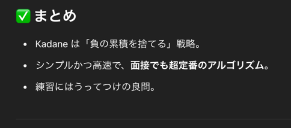

## 1st
- 累積和を使っても解けそうだなあと思ってごにゃごにゃやったけど、解けんので答えを見た
- [kadane's Algorithm](https://en.wikipedia.org/wiki/Maximum_subarray_problem)
- 部分配列の最大和を求めるためのアルゴリズムで有名らしい
- 方針は以下
  - `maxSum` にそれまで出現したサブアレイの最大和を保存するようにする
  - `currentSum(= num[i-1])` と `currentSum(= num[i-1]) + num[i]` のどちらか大きい方を記録する
    - 各位置 i において、`その位置で終わる最大部分配列の和`
    - 累積和っぽく見えるけど、大きい方を選択しているので異なる
  - `maxSum` は今まで見た中での最大の currentSum
```java
class Solution {
    public int maxSubArray(int[] nums) {
        int currentSum = nums[0];
        int maxSum = nums[0];

        for (int i = 1; i < nums.length; i++) {
            currentSum = Math.max(nums[i], currentSum + nums[i]);
            maxSum = Math.max(maxSum, currentSum);
        }

        return maxSum;
    }
}
```

## 2nd
- [Maximum Subarray Sum - Kadane's Algorithm](https://www.geeksforgeeks.org/largest-sum-contiguous-subarray/)
- パッと思い出せないので、さっさとこのアルゴリズムの方針を見る
- 
```java
class Solution {
    public int maxSubArray(int[] nums) {
        // 制約から、線形で解かないと TLE
        // dp[i] を i番目の要素を終点とする最大部分配列の和と定義する
        
        int maxEnding = nums[0];
        int result = nums[0];

        for (int i = 1; i < nums.length; i++) {
            maxEnding = Math.max(maxEnding + nums[i], nums[i]);
            result = Math.max(result, maxEnding);
        }

        return result;
    }
}
```
- サブアレイはこれでいいんだ

## 3rd

## 4th

## 5th
