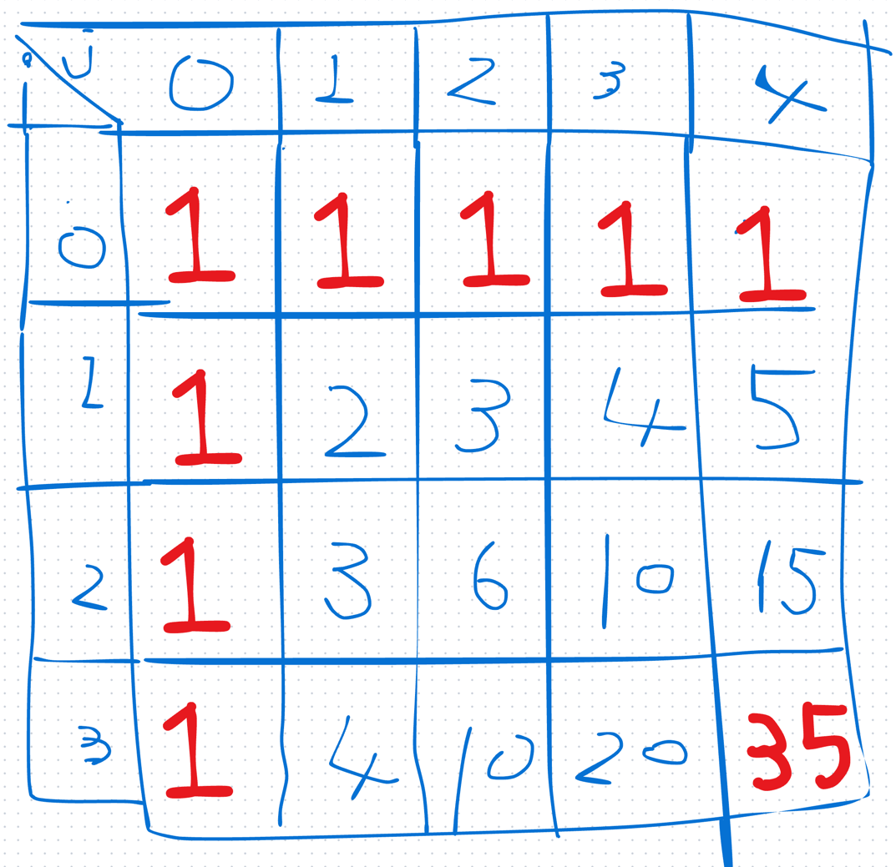

# 1st
- [62. Unique Paths](https://leetcode.com/problems/unique-paths/description/)
- 先の2問はどうも DP の定義通とすんなり理解できないものだった気がする
  - DP の定義: 大きい問題を解く過程で同じ小問題がなんども出てくるような場合に、小問題を解いた結果を保存しておいて再利用することで計算量を削減する方法
- 今回の問題は m * n グリッドが与えられる
- 右か下にしか進めない条件で (0,0) から (m,n) に至る過程が何通りあるか？を問われている
- (m,n) = (4,5) として、こんな感じにすればいいんじゃね？と言うイメージは湧く

- 初見書き上げこーど
```java
class Solution {
    public int uniquePaths(int m, int n) {
        int[][] dp = new int[m][n];
        dp[0][0] = 0;

        for (int i = 0; i < m; i++) {
            for (int j = 0; j < n; j++) {
                if (i == 0 || j == 0) { 
                    dp[i][j] = 1;
                } else {
                    dp[i][j] = dp[i - 1][j] + dp[i][j - 1];
                }
            }
        }

        return dp[m - 1][n - 1];
    }
}
```
```markdown
Constraints:
1 <= m, n <= 100
```
- 時間計算量
  - `O(m * n)` だが、最悪たかだか 10^4 回しか回らないので余裕で終わる
- 空間計算量
  - `O(n * m)` で済む

# 2nd

# 3rd

# 4th

# 5th
