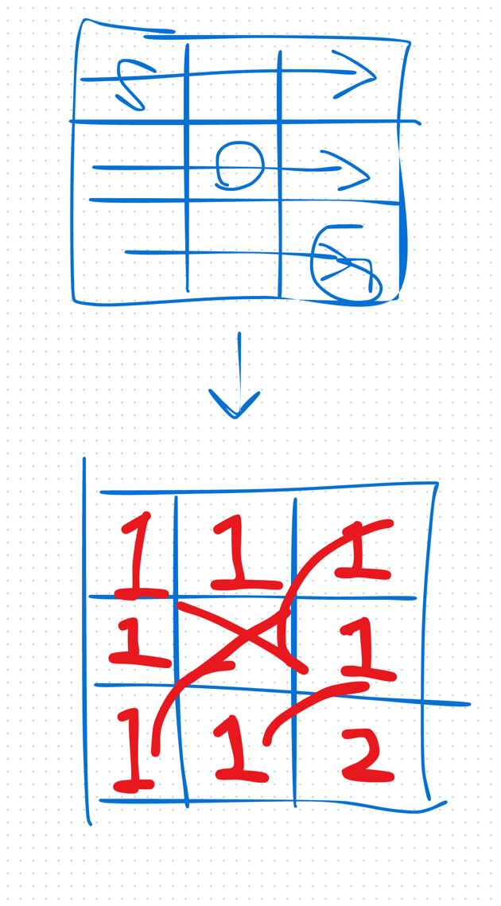
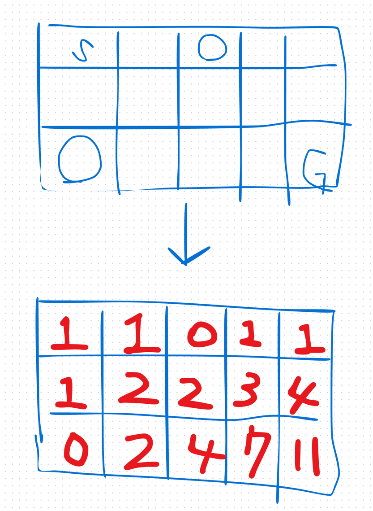
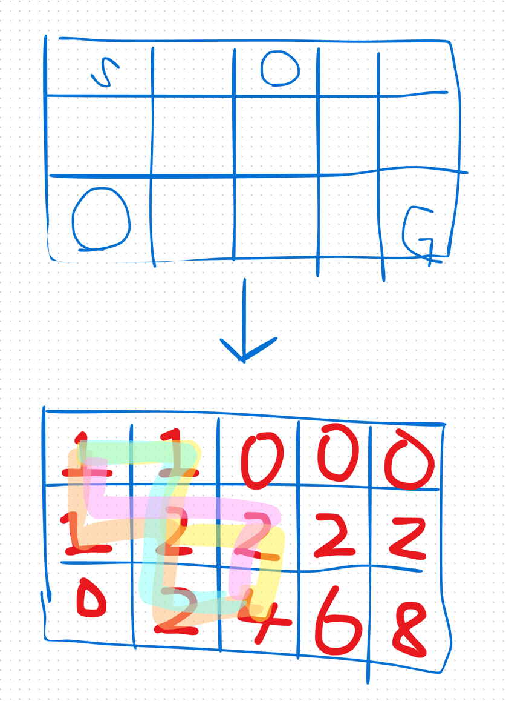
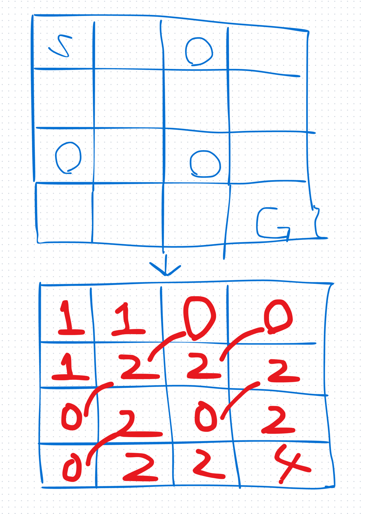
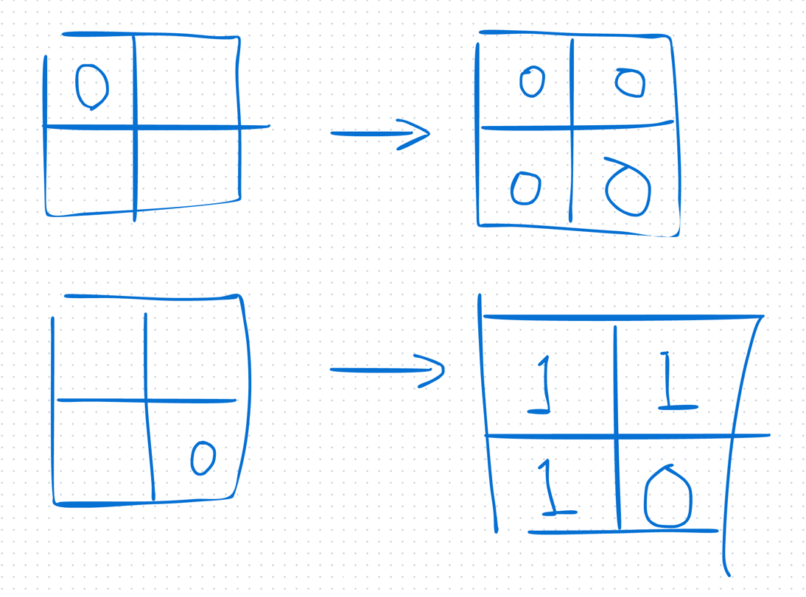

# 1st
- [63. Unique Paths II](https://leetcode.com/problems/unique-paths-ii/description/)
- 62 に障害物ありが追加されたようなもの
- どうやればうまくいくか考えてみる
- 方針
- 与えられた int 二次元配列をコピって新しく `int[][] dp` を作っていく
- とりあえず Ex.1 はこうしたら良さそうじゃない？
- `Input: obstacleGrid = [[0,0,0],[0,1,0],[0,0,0]]`


- Ex.2 はこうする？
- `Input: obstacleGrid = [[0,1],[0,0]]`


- 要するに、障害物があれば 0 と置き換えて、`dp[i][j] = dp[i-1][j] + dp[i][j-1]`と設計すれば良さそうか？
- こう言うテストケースはどうする？


- これは明らかに間違い(一行目の障害物より右は0でないといけない、同様に一列目の障害物より下は0でないといけない)
- そのため、障害物があった場合をもっと真面目に考えないといけない


  - 障害物が i = 0 and j は任意の位置に存在する場合、障害物より右は全て0
  - 障害物が i は任意 and j = 0 に存在する場合、障害物より下は全て0
  - 障害物が i != 0 && j != 0 に存在する場合、障害物に相当する位置は全て0


- AC したけど汚いね
```java
class Solution {
    public int uniquePathsWithObstacles(int[][] obstacleGrid) {
        int x = obstacleGrid[0].length;
        int y = obstacleGrid.length;
        int[][] dp = new int[y][x];

        // 一行に障害物が存在する場合、その列以降を0に置換するための処理
        boolean hasFirstRowObstacle = false;
        for (int row = 0; row < x; row++) {
            if (hasFirstRowObstacle) {
                dp[0][row] = 0;
            } else if (obstacleGrid[0][row] == 1) {
                dp[0][row] = 0;
              hasFirstRowObstacle = true;
            } else if (obstacleGrid[0][row] == 0) {
                dp[0][row] = 1;
            }
        }
        // 一列に障害物が存在する場合、その行以降を0に置換するための処理
        boolean hasFirstColumnObstacle = false;
        for (int column = 0; column < y; column++) {
            if (hasFirstColumnObstacle) {
                dp[column][0] = 0;
            } else if (obstacleGrid[column][0] == 1) {
                dp[column][0] = 0;
              hasFirstColumnObstacle = true;
            } else if (obstacleGrid[column][0] == 0) {
                dp[column][0] = 1;
            }
        }
        // 2行2列以降を走査
        for (int i = 1; i < y; i++) {
            for (int j = 1; j < x; j++) {
                // 障害物アリ
                if (obstacleGrid[i][j] == 1) {
                    dp[i][j] = 0;
                } else {
                    dp[i][j] = dp[i][j - 1] + dp[i-1][j];
                }
            }
        }

        return dp[y-1][x-1];
    }
}
```
- Constraints をみるとこういうエッジケースも考えられる
  - Start に障害物がある場合
  - Goal に障害物がある場合
- ちゃんと処理できているので問題ないかな



```markdown
Constraints:

m == obstacleGrid.length
n == obstacleGrid[i].length
1 <= m, n <= 100
obstacleGrid[i][j] is 0 or 1.
```
- 時間計算量
  - `O(m * n)`
- 空間計算量
  - `O(m * n)` 

# 2nd
- 綺麗にかける
```java
class Solution {
    public int uniquePathsWithObstacles(int[][] obstacleGrid) {
        // ループは回すんだけど、O(m*n) でいいので計算量は問題ない
        // 一行一列に障害物がある場合、行なら障害物より右は全て0,列なら障害物より下は全て0
        // 1st より綺麗に描きたい
        int m = obstacleGrid.length;
        int n = obstacleGrid[0].length;

        int[][] dp = new int[m][n];

        boolean hasFirstRowObstacle = false;
        boolean hasFirstColumnObstacle = false;

        for (int y = 0; y < m; y++) {
            for (int x = 0; x < n; x++) {
                if (obstacleGrid[y][x] == 1) {
                    dp[y][x] = 0;
                    if (x == 0) hasFirstColumnObstacle = true;
                    if (y == 0) hasFirstRowObstacle = true;
                } else if (x == 0) {
                    dp[y][x] = hasFirstColumnObstacle ? 0 : 1;
                } else if (y == 0) {
                    dp[y][x] = hasFirstRowObstacle ? 0 : 1;
                } else {
                    dp[y][x] = dp[y][x - 1] + dp[y - 1][x];
                }
            }
        }

        return dp[m - 1][n - 1];
    }
}
```
# 3rd

# 4th

# 5th
