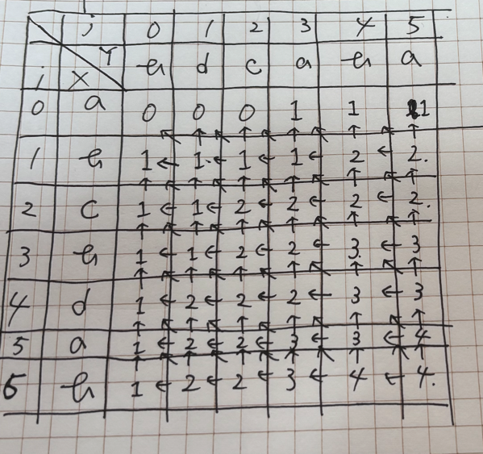

# DP(動的計画法)
- デ-タ構造とアルゴリズム (新・情報/通信システム工学 TKC-3) 7.2 動的計画法

# What?
- 大きい問題を解く過程で同じ小問題がなんども出てくるような場合に、小問題を解いた結果を保存しておいて再利用することで計算量を削減する方法
- 例として、最長共通部分列問題を理解する
  - 部分列: 列のいくつかの要素を取り除いてできた例のこと
  - 最長共通部分列: 与えられたに列から取り出した部分列のうち、」同一かつ最長のもののことをさす
  - Ex
    - `X = abcbdab`, `Y = bdcaba` とすると、最長共通部分列の一つとして `bcba` があげられる
- 最長共通部分列問題は応用分野の広い問題で、ソースコードを比較して差分を取るそうさ、音声認識において入力データとパターンを比較したりする場合などに使われる
- この問題を特には、考慮する列の長さを段々長くしながら最長共通部分列を更新していけばよく、疑似コードでは以下のようになる
```
Longest Common Substring(X,Y) {
    LCS <- X.length * Y.length の大きさの表(表範囲外は全て0とする)
    for (i <- 0 ...X.length) {
        for (j <- 0...Y.length) {
            d <- if (X[i] == Y[j]) なら 1 , else 0
            LCS[i,j] <- max(
                            LCS[i - 1, j - 1] + d,
                            LCS[i - 1, j],
                            LCS[i    , j - 1]
                        )
        }    
    }
}
```
- このアルゴリズムの動作は縦軸にX,横軸にYをとりi行j列の要素が LCS[i,j] となるような表を用意し、
- その表の中身をi及びjを順次増やしながら進めていくものと考えることができるね
- まず `i = 0 , j = 0` の場合は `LCS[i,j] = 0` 
- あとは上記の擬似コードに沿って表を埋めていくと、以下の画像のようになる
- 表の一番右下に入る数字が最小共通部分列の長さであり、そこへ至る左上から右下へのパスを辿ると最長共通部分列がえられる
  - これ、辿るって言っているけどよくわからんな
- 例題7.1 をちゃんと解いてみる


# LCSの文字列を「復元」するには？ 
- 右下`（i = X.length, j = Y.length）`から始めて： 
- `X[i-1] == Y[j-1]` なら： 
  - その文字は共通部分列に含まれる `X[i-1]` を記録して 
  - 左上に斜め移動 → (i-1, j-1)
- そうでない場合（`X[i-1] != Y[j-1]`）は： 
  - `LCS[i-1][j]` と `LCS[i][j-1]` を比較して、大きい方に移動 より「長い共通部分列を持つ方向」へ移動
- `(i, j)` が `(0, 0)` に達するまで繰り返す
- 擬似コード
```
i <- X.length
j <- Y.length
共通列 <- 空のリスト

while (i > 0 and j > 0) {
    if (X[i - 1] == Y[j - 1]) {
        共通列に X[i - 1] を追加（前から）
        i--
        j--
    } else if (LCS[i - 1][j] > LCS[i][j - 1]) {
        i--
    } else {
        j--
    }
}

共通列を反転（または後ろから追加していたならそのまま）
```