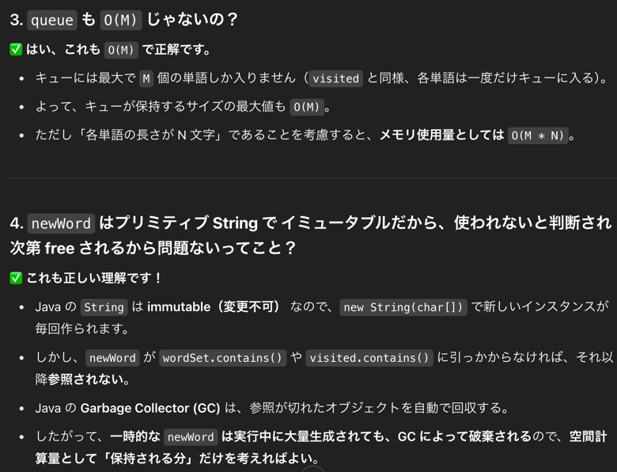

## 1st
- 問題がちょっと面倒くさいので先に頭入れておく
  - 文字列の変換問題
  - 与えられた2つの単語（`beginWord` と `endWord`）と、単語のリスト（`wordList`）を基に、最短の変換シーケンスを求める問題
  - 変換シーケンスの条件は以下
    - 変換シーケンスとは、`beginWord` から `endWord` まで、1文字ずつ変更することによって変換できる一連の単語を指す
    - 隣接する単語同士は、1文字だけが異なる必要がある
    - 変換に使用する単語は、必ず `wordList` に含まれている必要がある
    - ただし、`beginWord` は必ずしも `wordList` に含まれている必要はない
    - 最終的に、`endWord` まで到達できる最短の変換シーケンスの長さを求める
  - つまり？
    - `beginWork` を一文字ずつ変更する
    - 変更後の文字が `wordList` に入っていれば、再び一文字変更を繰り返し、何回繰り返したら endWord にたどり着くか？という問題
    - 早期リターン条件
      - `endWord` が `wordList` に入っていない段階で 0 を返す仕様
```java
class Solution {
    public int ladderLength(String beginWord, String endWord, List<String> wordList) {
        if (!wordList.contains(endWord)) return 0;

        Set<String> wordSet = new HashSet<>(wordList);
        Queue<String> queue = new LinkedList<>();
        queue.add(beginWord);

        Set<String> visited = new HashSet<>();
        visited.add(beginWord);

        int count = 1;

        while (!queue.isEmpty()) {
            int size = queue.size();

            for (int i = 0; i < size; i++) {
                String word = queue.poll();
                char[] wordArr = word.toCharArray();

                for (int j = 0; j < wordArr.length; j++) {
                    char originalChar = wordArr[j];

                    for (char c = 'a'; c <= 'z'; c++) {
                        if (c == originalChar) continue;

                        wordArr[j] = c;
                        String newWord = new String(wordArr);

                        if (newWord.equals(endWord)) {
                            return count + 1;
                        }

                        if (wordSet.contains(newWord) && !visited.contains(newWord)) {
                            queue.add(newWord);
                            visited.add(newWord);
                        }
                    }

                    wordArr[j] = originalChar; // 元に戻す
                }
            }

            count++;
        }

        return 0;
    }
}
```
- 時間計算量
  - `O(M * N * 24) で定数落として O(M * N)`
  
- 空間計算量
  - `O(M * N)`
  - 詳細
  
  


## 2nd

## 3rd

## 4th

## 5th
