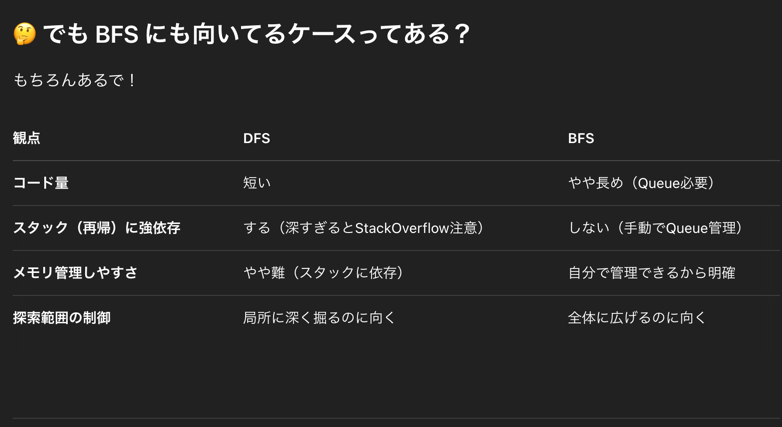

## 1st
- 問題は 0,1 で与えられる二次元配列のうち、1 が上下左右いずれかが連結されているものを島とみなし、島の数を返却することを目的とする
- 回答方針が2パターンあるので両方やるで
- 制約
```markdown
Constraints:

m == grid.length
n == grid[i].length
1 <= m, n <= 300
grid[i][j] is '0' or '1'.
```

### DFS (depth-first search) ✅
- 方針としては、二次元配列を二重ループで回して全ての要素にアクセスする
- その要素について、上下左右が島なら海に変更する処理を再帰的に行えばよい
- 個人的にはこっちの方が直感的でわかりやすい
```java
class Solution {
    public int numIslands(char[][] grid) {

        int count = 0;

        for (int x = 0; x < grid.length; x++) {
            for (int y = 0; y < grid[0].length; y++) {
                // 島があれば dfs かけて隣接している島を全て海に変更する
                if (grid[x][y] == '1') {
                    dfs(grid, x, y);
                    count++;
                }
            }
        }

        return count;
    }

    private void dfs(char[][] grid, int x, int y) {
        // x, y 軸が溢れたら処理終了
        if (x < 0 || x >= grid.length || y < 0 || y >= grid[0].length || grid[x][y] == '0') return;

        // 海に変更する
        grid[x][y] = '0';

        // 上下左右に dfs かける
        dfs(grid, x - 1, y);
        dfs(grid, x + 1, y);
        dfs(grid, x, y - 1);
        dfs(grid, x, y + 1);
    }
}
```
- 計算量
  - grid 二重ループなんで問題文の制約から `O(n * m)`
- 空間計算量
  - 特に何も生成してないので O(1) ❌
    
  - スタックに乗って `O(n * m)` なんや、なるほどなあ
- ⚠️問題点⚠️
  - 再帰関数を使うため、スタックに乗るのでスタックオーバーフローが発生して落ちる可能性がある

### BFS (breadth-first search) ✅
- 方針
  - DFS とあんま変わらんが、池にぽちゃんと落とした石が波を起こすようなイメージが近いって言われてなるほどとなった
- [NUMBER OF ISLANDS - Leetcode 200 - Python](https://www.youtube.com/watch?v=pV2kpPD66nE) は BFS だね
- 直感的にわかりにくい、なんで Queue と LinkedList 使うねんって感じ
- 最初の 0,0 インデックスが与えられた時を input1 を例に考えると
```java
class Solution {
    public int numIslands(char[][] grid) {
        int count = 0;
        int m = grid.length;
        int n = grid[0].length;

        for (int x = 0; x < m; x++) {
            for (int y = 0; y < n; y++) {
                if (grid[x][y] == '1') {
                    bfs(grid, x, y);
                    count++;
                }
            }
        }

        return count;
    }

    private void bfs(char[][] grid, int startX, int startY) {
        int m = grid.length;
        int n = grid[0].length;

        Queue<int[]> queue = new LinkedList<>();
        queue.offer(new int[] {startX, startY});

        grid[startX][startY] = '0';  // visited にする

        int[][] directions = {
            {-1, 0}, {1, 0}, {0, -1}, {0, 1}  // 上下左右
        };

        while (!queue.isEmpty()) {

            int[] current = queue.poll();
            int x = current[0];
            int y = current[1];

            for (int[] dir : directions) {
                int nx = x + dir[0];
                int ny = y + dir[1];

                if (nx >= 0 && nx < m && ny >= 0 && ny < n && grid[nx][ny] == '1') {
                    queue.offer(new int[] {nx, ny});
                    grid[nx][ny] = '0';
                }
            }
        }
    }
}
```
- 時間計算量
  - `O(m * n) `
- 空間計算量
  - `O(m * n)`

### DFS, BFS の違いとそれぞれに向いているパターン


## 2nd

## 3rd

## 4th

## 5th
