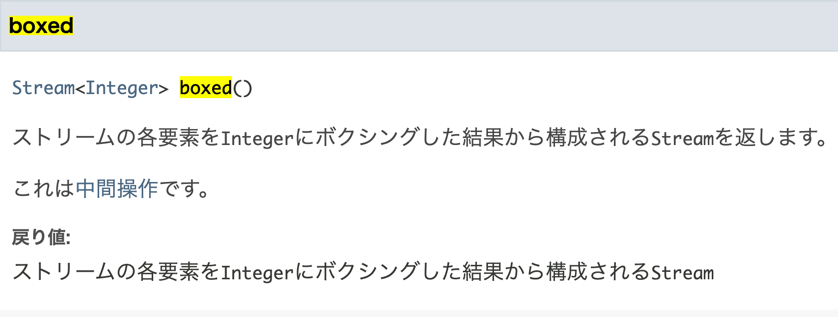
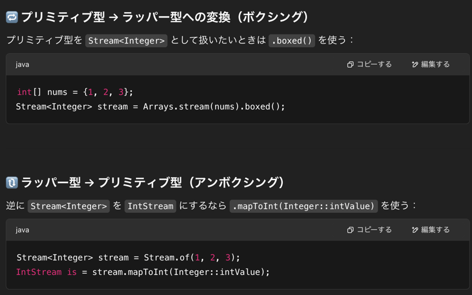
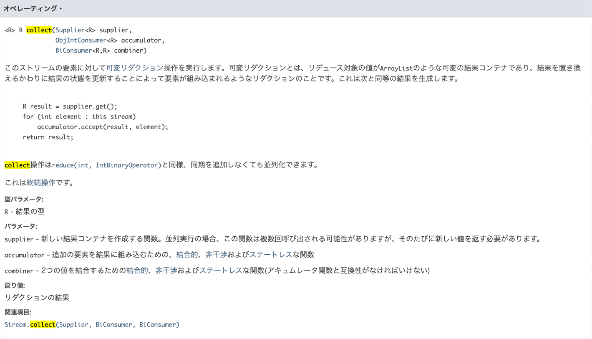
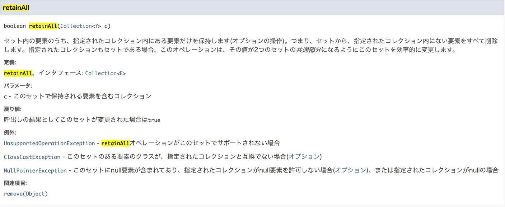
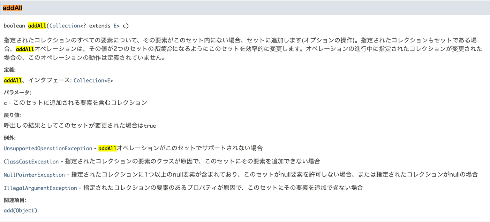

## 1st
- 問題文の intersection の意味がちょっとよくわからなかったが、nums1 と nums2 に重複する要素を返却すればよいと chatgpt が教えてくれた
- 方針は nums1,nums2 の重複要素を排除した Set をそれぞれ作り、2つの Set の積集合を取れば良い
- Java の stream は RxJava でちょっとみたけど書き慣れてないなあ😅
```java
class Solution {
    public int[] intersection(int[] nums1, int[] nums2) {
        Set<Integer> set1 = Arrays.stream(nums1)
                .boxed() // ボクシングしてプリミティブからラッパーへ変換
                .collect(Collectors.toSet());

        Set<Integer> set2 = Arrays.stream(nums2)
                .boxed() // ボクシングしてプリミティブからラッパーへ変換
                .collect(Collectors.toSet());

        // set1 set2 の積集合を取ればいい
        set1.retainAll(set2);
        return set1.stream().mapToInt(Integer::intValue).toArray();
    }
}
```
- あとプリミティブとそれラップしてるクラスと、コレクションと Stream がどういう関係になっているのか全体像を把握したいな
- [IntStream](https://docs.oracle.com/javase/jp/8/docs/api/java/util/stream/IntStream.html)
    - [boxed](https://docs.oracle.com/javase/jp/8/docs/api/java/util/stream/IntStream.html#boxed--)
        - 
        - 
    - [collect](https://docs.oracle.com/javase/jp/8/docs/api/java/util/stream/IntStream.html#collect-java.util.function.Supplier-java.util.function.ObjIntConsumer-java.util.function.BiConsumer-)
        - 
    - 積集合
        - [retainAll](https://docs.oracle.com/javase/jp/8/docs/api/java/util/Set.html#retainAll-java.util.Collection-)
            - 
    - 和集合(もある)
        - [addAll](https://docs.oracle.com/javase/jp/8/docs/api/java/util/Set.html#addAll-java.util.Collection-)
        - 
    - Stream で操作できるコレクションとかとか
        - https://chatgpt.com/c/6801e502-486c-8009-8cd3-df2b0eff1f57
    - そもそもなんでプリミティブ型とラッパー型に分かれているんだっけ？
        - プリミティブ型は C っぽい感じ int は 4バイト
        - ラッパー型はラッパーなので便利な感じ、16~24バイトくらい
## 2nd

## 3rd

## 4th

## 5th
