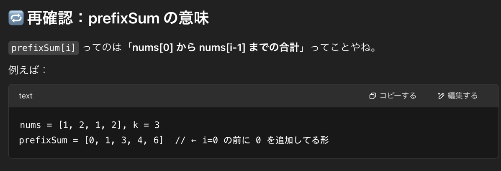
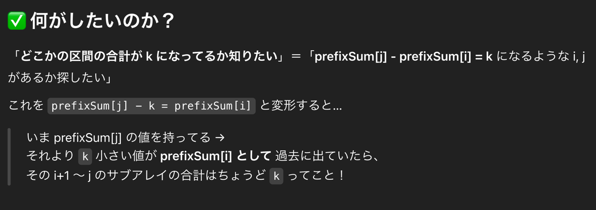

## 1st
- input
  - nums: int[] `1 <= nums.length <= 2 * 104`, `-1000 <= nums[i] <= 1000`
  - k: target number. nums のサブアレイの sum と等しいかで用いる
- 整数配列 nums に含まれるサブアレイの和が k と等しいサブアレイの個数を返却する
- サブアレイってなんやっけ？
  - `nums = [1, 2, 1, 2]` の時、
  - i = 0 → [1], [1,2], [1,2,3], [1,2,3,4]  
    i = 1 → [2], [2,3], [2,3,4]  
    i = 2 → [3], [3,4]  
    i = 3 → [4]
- サブアレイを全部作ってその和と target 比較すればいいんやけど、サブアレイ作成過程で o(N^2) が確定しちゃう
- 制約で nums.length = 10^4 やから、最悪時間計算量が 4*10^8 になるんで、4億回でタイムオーバー
- hashMap を使って対処しようねって問題や
```java
class Solution {
  public int subarraySum(int[] nums, int k) {
    /// 累積和、累積和の出現回数を map に保存
    HashMap<Integer, Integer> map = new HashMap<>();

    map.put(0,1);
    int prefixSum = 0;
    int count = 0;

    for (int num : nums) {
      prefixSum += num;
      if (map.containsKey(prefixSum - k)) {
        count += map.get(prefixSum - k);
      }

      map.put(prefixSum, map.getOrDefault(prefixSum, 0) + 1);
    }

    return count;
  }
}
```
- 時間計算量
  - O(N)
- 空間計算量
  - map が nums のサイズにほぼ依存するのでO(N)
- 注意
  - サブアレイの和がどうなっているかを O(N) で知りたければ累積和を使おう
## 2nd
- どうもすんなり行かなかったので簡易的に復習
```java
class Solution {
    public int subarraySum(int[] nums, int k) {
        /// サブアレイを作ればいいじゃん
        /// あ、計算量がダメなのか
        /// どうにか、O(N) で回しきりたい
        /// 和を知りたいって言っている、累積和を使えばいいんじゃない？という発想
        /// input1 について、累積和 = 1,2,3 になる
        /// input2 について、累積和 = 1,3,6 になる、k = 3
        /// input2 について考えると、累積和[2] - 累積和[1] を計算すると、3 になり、nums[2] と等しいことがわかる
        /// ここから、累積和を HashMap につめて prefixSum - k が map にあるかどうか都度検索してカウントすればいい！
        /// の発想に至らないんだよなあ。。。
    }
}
```
- 方針としてここまで書けるが、prefixSum - k が map にあるかどうか？のロジックがどうもすんなり理解できない。。
  
  
- 数式で理解した方がわかりいいかな
- 理解でけへんのにロジックは書けるという意味不明な感じなのでこの問題は引きずるやつやな〜という認識
- LinkedList も最初は同じやったからまあいつか理解できるやろ
## 3rd

## 4th

## 5th
