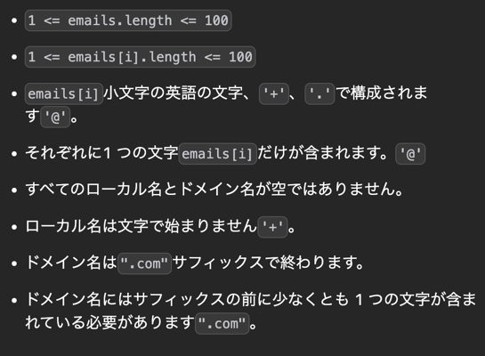

## 1st
- メールアドレスが与えられる
- @ より前の文字列を local, @ より後の文字列を domain とする
- local に対して2つの制約があるのでその制約をクリアして再度 domain と結合させた時、ユニークなメールアドレスがいくつあるか？という問題
  - 制約
    1. `.` は無効
    2. `+` 以降の文字列は無効
- データ量の制約
  - 
```java
class Solution {
    public int numUniqueEmails(String[] emails) {
        Set<String> set = new HashSet<>();
        for (String email : emails) {            
            String[] splitedEmail = email.split("@");
            String localName = splitedEmail[0];
            String fixedLocalName = fixedLocalName(localName);

            StringBuilder sb = new StringBuilder();
            sb.append(fixedLocalName);
            sb.append("@");
            sb.append(splitedEmail[1]);

            set.add(sb.toString());
        }
        return set.size();
    }

    // ここで抽象的に巻き取って、具体の処理は以下で
    private String fixedLocalName(String localName) {
        return removePlusAndAfter(removeAllDots(localName));
    }

    private String removeAllDots(String localName){
        // エスケープシーケンス必要
        return localName.replaceAll("\\.", "");
    }

    private String removePlusAndAfter(String localName){
        int plusIndex = localName.indexOf("+");
        if (plusIndex == -1) {
            return localName;
        } else {
            return localName.substring(0, plusIndex);
        }
    }
}
```
- 時間計算量
    1. 最初のループで O(N)、最悪 10^3
    2. ループの `removeAllDots()` ないで replaceAll が走って線形操作するはず、ローカルの平均文字列を L とすると O(L)かかる
    3. その後の `removePlusAndAfter()` で indexOf で線形操作しているので、ローカルの平均文字列を L とすると O(L) かかる
    4. その後の `substring()` の計算量は走査を必要としないので O(1)
    5. 合計すると、O(N * 2 * O(L)) になって、定数は落とせるので O(N * L) になる
- 空間計算量
    1. set に対して、N(emails.length) * L(平均 emails[i].length) が入るので O(N * L)
    2. String 配列を毎回作るので O(String のバイト数 * 2)
    3. stringBuffer が同様に `O(N * L)`
    4. `2 * O(N * L)` なので、`O(N * L)` とみなせる 
- 注意
  - `["test.email+alex@leetcode.com","test.email.leet+alex@code.com"]`
  - このテストケース時に、`sb.append(@)` を抜くと偶然一致してしまい重複要素としてカウントされないので注意
## 2nd

## 3rd

## 4th

## 5th
