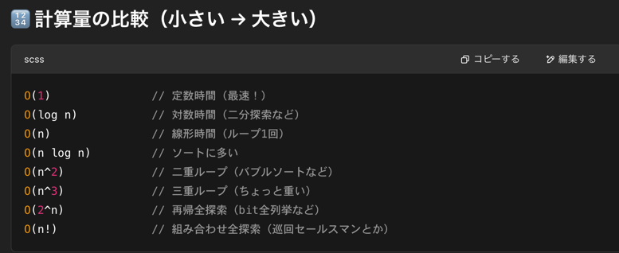

## 目的
- 重複要素を含むint配列が与えられる
- 自然数kが与えられる
- int 配列の中で重複する要素を数え、多い順にk番目まで重複する要素を出力する

## まず思いついた解法
- HashMap 使ってカウントして、key,value 使ってうまいことリストに格納すればいいんちゃう？
- ヒープを使う発想が出てこなくてわろた

## 事前学習
- 方針として2つあるみたい
- 目的がお勉強なので両方やってみる
  1. HashMap 使ってカウントするバケットソート
  2. ヒープを使う方法

## 1st
### 1. バケットソート
  - イメージは [wiki概要](https://ja.wikipedia.org/wiki/%E3%83%90%E3%82%B1%E3%83%83%E3%83%88%E3%82%BD%E3%83%BC%E3%83%88#%E6%A6%82%E5%BF%B5)を読んでみて
  - 重複要素をカウント、二次元リストを用意しそのリスト内の重複した数に該当するインデックスに重複した数を保存する方法
  - AC するか怪しいけど一旦考えたコード
```java
class Solution {
    public int[] topKFrequent(int[] nums, int k) {
        // バケットソートパターン
        HashMap<Integer, Integer> map = new HashMap<>();
        ArrayList<ArrayList<Integer>> list = new ArrayList<>();
        ArrayList<Integer> result = new ArrayList<>();

        // 重複カウント処理 O(n)
        for (int num : nums) {
            if (map.containsKey(num)) {
                int value = map.get(num) + 1;
                map.put(num, value);
            } else {
                map.put(num, 1);
            }
        }

        // nums + 1 の空リストを二次元配列へ突っ込んでおく
        for (int i = 0; i <= nums.length; i++) {
            list.add(new ArrayList<Integer>());
        }

        // map から key と value を持ってきて、二次元リストの value 位置に key を保存
        Set<Integer> keys = map.keySet();
        for (int key : keys) {
            int value = map.get(key);
            list.get(value).add(key);
        }

        // 結果を得るために、リストの最後からk個の要素を取得
        for (int i = list.size() - 1; i >= 0 && k > 0; i--) {
            for (int num : list.get(i)) {
                if (k-- > 0) {
                    result.add(num);
                } else {
                    break;
                }
            }
        }

        return result.stream().mapToInt(Integer::intValue).toArray();
    }
}
```

- chatGpt に綺麗に書かせた方のコード
- 最後の stream に渡して int 配列を作るところは本当にこうじゃなきゃダメなのか。。。
- 明日の復習でもっといいコード書けるか試してみよ
```java
class Solution {
    public int[] topKFrequent(int[] nums, int k) {
        // Step 1: 出現回数をカウントするための HashMap を作成
        HashMap<Integer, Integer> frequencyMap = new HashMap<>();
        
        // nums 配列の各要素について、その出現回数をカウント
        for (int num : nums) {
            frequencyMap.put(num, frequencyMap.getOrDefault(num, 0) + 1);
        }

        // Step 2: 出現回数のリスト（バケットソートに相当するもの）を作成
        // 出現回数の最大値は nums.length であるため、リストの長さは nums.length + 1 にする
        ArrayList<ArrayList<Integer>> buckets = new ArrayList<>();
        
        // 空のリストを nums.length + 1 個作成
        for (int i = 0; i <= nums.length; i++) {
            buckets.add(new ArrayList<>());
        }

        // Step 3: 出現回数に応じたバケットに要素を追加
        for (int num : frequencyMap.keySet()) {
            int count = frequencyMap.get(num);  // 出現回数
            buckets.get(count).add(num);        // 出現回数のバケットに追加
        }

        // Step 4: 結果となる最頻出の k 個の要素を取得
        ArrayList<Integer> result = new ArrayList<>();
        
        // バケットリストを後ろからループして、頻度が高い順に要素を追加
        for (int i = buckets.size() - 1; i >= 0 && result.size() < k; i--) {
            for (int num : buckets.get(i)) {
                if (result.size() < k) {
                    result.add(num);
                } else {
                    break;  // k 個取り出したら終了
                }
            }
        }

        // Step 5: 結果を int 配列に変換して返す
        return result.stream().mapToInt(Integer::intValue).toArray();
    }
}

```

### ヒープを使った実装
- 方針も何も思いつかないので chatGpt に雑に投げる
```java
class Solution {
    public int[] topKFrequent(int[] nums, int k) {
        HashMap<Integer, Integer> freqMap = new HashMap<>();

        // 重複要素カウント
        for (int num : nums) {
            if (freqMap.containsKey(num)) {
                int temp = freqMap.get(num) + 1;
                freqMap.put(num, temp);
            } else {
                  freqMap.put(num, 1);
            }
        }

        // 重複カウントした map の先頭から線形に key,value セットを取り出し、比較して最小キューを作成せよ
        // という命令
        // b.getValue() - a.getValue() を指定すると、最大キューを作成せよという命令になる
        PriorityQueue<Map.Entry<Integer, Integer>> heap = 
            new PriorityQueue<>((a, b) -> a.getValue() - b.getValue());

        // 実際に map から Integer=Integer のセットで heap にオファーかけていく
        for (Map.Entry<Integer, Integer> entry : freqMap.entrySet()) {
            heap.offer(entry);
            if (heap.size() > k) {
                heap.poll(); // 最も出現回数が少ない要素を削除
            }
        }

        // ヒープから要素を取り出して答えを作る
        int[] result = new int[k];
        for (int i = k - 1; i >= 0; i--) {
            result[i] = heap.poll().getKey();
        }

        return result;
    }
}

```


## 2nd
- 問題文の理解を一部間違っていた
- k個は出現回数が重複していた場合、その中で任意のk個を返却できれば良い
  - 問題文の中に、You may return the answer in any order. とあるので、順序は問われていないことに注意
### バケットソート復習
- 綺麗にすることよりも、考え方の筋道がわかるようなコードにしてみた
```java
class Solution {
    public int[] topKFrequent(int[] nums, int k) {
        HashMap<Integer, Integer> map = new HashMap<>();
        // バケットソート用の 二次元配列
        ArrayList<ArrayList<Integer>> bucket_list = new ArrayList<>();

        // 重複要素カウント
        for (int num : nums) {
            if (map.containsKey(num)) {
                int temp = map.get(num) + 1;
                map.put(num, temp);
            } else {
                  map.put(num, 1);
            }
        }
        
        // バケットソートの実装準備
        for (int i = 0; i <= nums.length ; i++) {
            bucket_list.add(new ArrayList<Integer>());
        }

        // バケットソートの実装
        map.forEach((key, value) -> {
            bucket_list.get(value).add(key);
        });

        // 後ろからk番目の要素を取得し int 配列に詰めて返却する
        ArrayList<Integer> result = new ArrayList<>();
        for (int i = bucket_list.size() - 1; i >= 0 && k > 0; i--) {
            ArrayList<Integer> temp = bucket_list.get(i);
            
            if (temp.isEmpty()) {
                continue;
            } else {
                for (int num : temp) {
                    result.add(num);
                    k--;
                }
            }
        }

        return result.stream().mapToInt(i -> i).toArray();
    }
}
```

- chatGpt に綺麗にさせたコード
  - 初期化処理は上へ
  - 出現回数カウントはスッキリ
  - entrySet 関数は forEach で回すより for で回した方がラムダ式分のオーバヘッドが少ないから早いと考えられる
  - 後ろから k個だけとるところはもっと綺麗にかけるんちゃうかなあ
```java
class Solution {
    public int[] topKFrequent(int[] nums, int k) {
        Map<Integer, Integer> freqMap = new HashMap<>();
        List<List<Integer>> bucket = new ArrayList<>(nums.length + 1);

        // バケット初期化
        for (int i = 0; i <= nums.length; i++) {
            bucket.add(new ArrayList<>());
        }

        // 出現回数を数える
        for (int num : nums) {
            freqMap.put(num, freqMap.getOrDefault(num, 0) + 1);
        }

        // 出現回数に応じてバケットに詰める
        for (Map.Entry<Integer, Integer> entry : freqMap.entrySet()) {
            bucket.get(entry.getValue()).add(entry.getKey());
        }

        // 後ろから k 個だけ集める
        List<Integer> result = new ArrayList<>();
        for (int i = bucket.size() - 1; i >= 0 && result.size() < k; i--) {
            for (int num : bucket.get(i)) {
                result.add(num);
                if (result.size() == k) break;
            }
        }

        // int[]に変換して返す
        return result.stream().mapToInt(i -> i).toArray();
    }
}
```

### ヒープの復習
- 前回との差分で offer ではなく add にした
- offer は追加不能だった時に bool を返す
- add は例外で落ちる
- 今回は add の失敗をハンドリングする仕様もないので、get でいいかな
- 時間計算量の制限も満たせているか？
  - `Follow up: Your algorithm's time complexity must be better than O(n log n), where n is the array's size.`
  - O(NlogN)より優れていなければならないということで復習
  - 
  - 以下のコメントより、最終的な計算量は最も時間のかかる部分が支配項となり O(Nlogk) になる
  
```java
class Solution {
    public int[] topKFrequent(int[] nums, int k) {
        
        HashMap<Integer,Integer> map = new HashMap<>();

        // 時間計算量 O(N)
        for (int num : nums) {
            map.put(num, map.getOrDefault(num, 0) + 1);
        }
      
        // ↑ ここまでは同じ

        // Map形式で heap を作成
        // value(出現回数) で最小ヒープを作成する設定を組む
        PriorityQueue<Map.Entry<Integer, Integer>> heap = 
            new PriorityQueue<>((a,b) -> a.getValue() - b.getValue());
      
        // add と同時に k を超えたら poll する
        // 時間計算量: for で回しているので O(N logk)
        for (Map.Entry<Integer, Integer> entry : map.entrySet()) {
            // 時間計算量 O(logk)
            heap.add(entry);
            if (heap.size() > k) {
                heap.poll();
            }
        }

        int[] result = new int[k];
        // 時間計算量 O(k)
        for (int i = k - 1; i >= 0; i--) {
            result[i] = heap.poll().getKey();
        }

        return result;
    }

}
```

## 3rd
- なんも見ずに書いたバケットソート
```java
class Solution {
    public int[] topKFrequent(int[] nums, int k) {
        
        // バケットソート的アプローチ
        HashMap<Integer,Integer> map = new HashMap<>();

        for (int num : nums) {
            map.put(num, map.getOrDefault(num, 0) + 1);
        }

        ArrayList<ArrayList<Integer>> list = new ArrayList<ArrayList<Integer>>();

        for (int i = 0; i <= nums.length; i++) {
            list.add(new ArrayList<Integer>());
        }

        for (Map.Entry<Integer, Integer> entry : map.entrySet()) {
            int freq = entry.getValue();
            int num = entry.getKey();
            list.get(freq).add(num);
        }

        ArrayList<Integer> result = new ArrayList<>();
        for (int i = list.size() - 1; i >= 0 && k > 0; i--) {
            for (int num : list.get(i)) {
                result.add(num);
                k--;
                if (k == 0) break;
            }
        }

        int[] ans = new int[result.size()];
        for (int i = 0; i < result.size(); i++) {
            ans[i] = result.get(i);
        }
        return ans;
    }

}
```
- 時間が経つと汚くなるな。。まだまだ鍛錬が足りない

## 4th

## 5th
