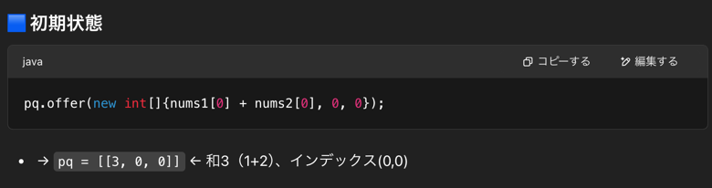
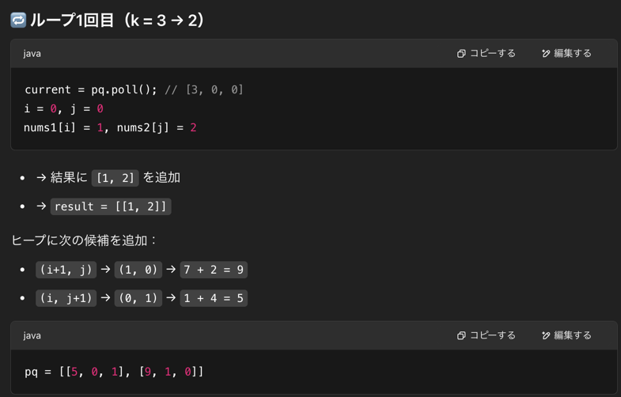
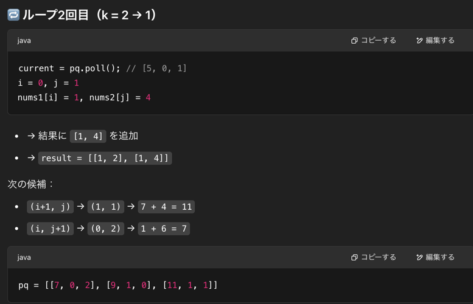
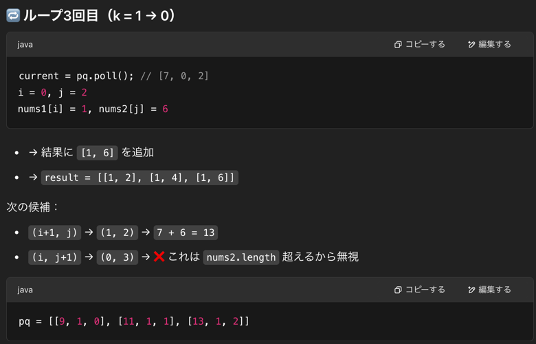
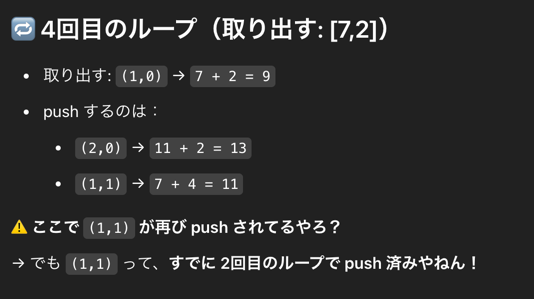
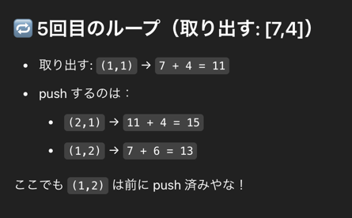

## 目的
- num1,num2 配列が与えられるので、それぞれの要素同士のペアの合計を計算し、そのペアをk個返却せよ

## 制約
- `1 <= nums1.length, nums2.length <= 10^5`
- `-10^9 <= nums1[i], nums2[i] <= 10^9`
- `nums1 and nums2 both are sorted in non-decreasing order.`
- `1 <= k <= 10^4`
- `k <= nums1.length * nums2.length`

## まず思いついた解法
- 2重ループで計算してペアのリストを作る
- PriorityQueue のコンストラクタで最大ヒープに変更する
- 最後にヒープから k 個取得して返却する

## 事前学習
- 703, 347 の復習

## 1st
- 書いている途中でわかっていたけど、メモリバーストした(num1,num2 が 10^4 通りずつある場合があるので)
- もっと計算量を少なく、実行時間を削減するための工夫をしないといけない
```java
class Solution {
    public List<List<Integer>> kSmallestPairs(int[] nums1, int[] nums2, int k) {

        // 最小ヒープを作成する
        PriorityQueue<List<Integer>> priorityQueue = new PriorityQueue<>(
                k + 1,
                (a, b) -> (b.get(0) + b.get(1)) - (a.get(0) + a.get(1))
        );

        List<List<Integer>> list = new ArrayList<>();

        // ここで計算回数が O(N^2) になってしまう
        for (int num1 : nums1) {
            for (int num2 : nums2) {
                List<Integer> temp = new ArrayList<>();
                temp.add(num1);
                temp.add(num2);
                priorityQueue.add(temp);
                if (priorityQueue.size() > k) {
                    priorityQueue.poll();
                }
            }
        }

        List<List<Integer>> result = new ArrayList<>();
        while (!priorityQueue.isEmpty()) {
            result.add(priorityQueue.poll());
        }

        return result;
    }
}
```
- [Editorial](https://leetcode.com/problems/find-k-pairs-with-smallest-sums/editorial) を読んで、ソート済みの配列を有効活用せにゃならんというのはわかつたぞ

## 2nd
- 理解できた、面白い
- `Input: nums1 = [1,7,11], nums2 = [2,4,6], k = 3` の場合
- 初期状態
  - 
- ループ1回目
  - 
- ループ2回目
  - 
- ループ3回目
  - 
- ループ4回目
  - 
  - ここで重複要素が入ってしまうやんけ。。。
- ループ5回目
  - 

```java
import java.util.*;

class Solution {
    public List<List<Integer>> kSmallestPairs(int[] nums1, int[] nums2, int k) {
        List<int[]> result = new ArrayList<>();

        // Integer.compare(a[0], b[0]) は、ヒープに新しく追加する要素と、ヒープのルート（最小の値）を比較
        // int配列の0番目、つまり後述の和を比較している
        PriorityQueue<int[]> pq = new PriorityQueue<>((a, b) -> Integer.compare(a[0], b[0]));

        // int配列に 和、num1インデックス、nums2インデックスを入れていくイメージ
        // 最初に絶対に最小値のペアになる nums1[0] + nums2[0], 0 ,0 を入れておく
        // input example 1 の場合は [3,0,0] が入っている
        pq.offer(new int[]{nums1[0] + nums2[0], 0, 0});

        // 方針は、i,j を交互に一つずつ進ませて和を取り、その二つを最小ヒープに入れて比較する処理をk回繰り返すこと
        while (k-- > 0 && !pq.isEmpty()) {
            // [3,0,0] を取り出して削除
            int[] current = pq.poll();
            int sum = current[0];
            int i = current[1];
            int j = current[2];
            
            result.add(new int[]{nums1[i], nums2[j]});
            
            // 次にi+1を使う場合
            if (i + 1 < nums1.length) {
                pq.offer(new int[]{nums1[i + 1] + nums2[j], i + 1, j});
            }
            
            // 次にj+1を使う場合
            if (j + 1 < nums2.length) {
                pq.offer(new int[]{nums1[i] + nums2[j + 1], i, j + 1});
            }
        }

        return result;

    }
}
```

- 重複要素が入る可能性を考慮して、Set で回避するみたいな処理もひつようなのでは？ということで書いてみた
```java
import java.util.*;

class Solution {
    public List<List<Integer>> kSmallestPairs(int[] nums1, int[] nums2, int k) {
        List<List<Integer>> result = new ArrayList<>();
        if (nums1.length == 0 || nums2.length == 0 || k == 0) return result;

        PriorityQueue<int[]> pq = new PriorityQueue<>((a, b) -> Integer.compare(a[0], b[0]));
        Set<String> visited = new HashSet<>();

        // 初期ペア (0,0)
        pq.offer(new int[]{nums1[0] + nums2[0], 0, 0});
        visited.add("0,0");

        while (k-- > 0 && !pq.isEmpty()) {
            int[] current = pq.poll();
            int i = current[1];
            int j = current[2];

            result.add(Arrays.asList(nums1[i], nums2[j]));

            // 次に (i+1, j) を追加（まだ訪問していない場合のみ）
            if (i + 1 < nums1.length && !visited.contains((i + 1) + "," + j)) {
                pq.offer(new int[]{nums1[i + 1] + nums2[j], i + 1, j});
                visited.add((i + 1) + "," + j);
            }

            // 次に (i, j+1) を追加（まだ訪問していない場合のみ）
            if (j + 1 < nums2.length && !visited.contains(i + "," + (j + 1))) {
                pq.offer(new int[]{nums1[i] + nums2[j + 1], i, j + 1});
                visited.add(i + "," + (j + 1));
            }
        }

        return result;
    }
}
```

## 3rd
## 4th
## 5th
