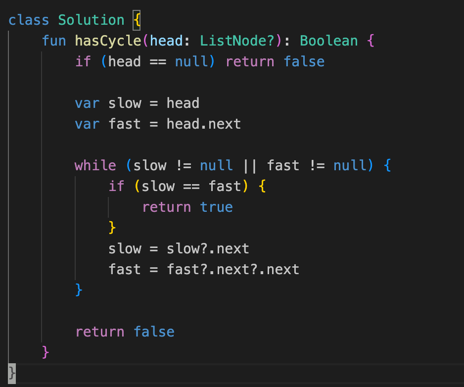

## 目的
- 循環リストが存在する場合 true 存在しない場合は false を返却する
- 引数が null の場合は false を返却する


## 解法
- Floyd's cycle-finding algorithm
- カメとうさぎで例えられるアルゴリズムを使用



## 別解
- https://github.com/hayashi-ay/leetcode/pull/15/files を参照

## 所感
- set でやる方法もフロイドのアルゴリズムを知る前なら考えついたかも、なるほどな

## 1th
```kotlin
    fun hasCycle(head: ListNode?): Boolean {
        if (head == null) return false

        var slow = head
        var fast = head

        while (fast != null && fast?.next != null) {
            if (slow == fast) {
                return true
            }
            slow = slow?.next
            fast = fast?.next?.next
        }

        return false
    }
```

## 2nd

## 3rd

## 4th

## 5th