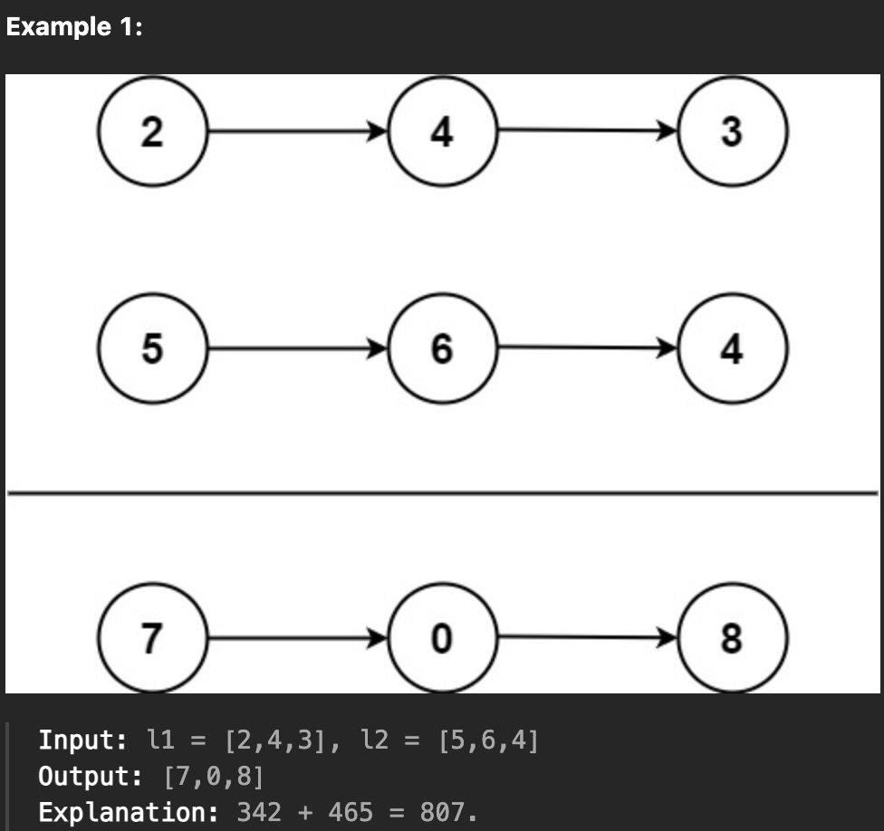

## 目的
- 与えられた2つの単方向リストがある
- 格桁の和を計算し、その和を要素の value とする単方向リストを返却する
- 繰り上げを考慮する　
- 

## 解法
- 一旦、簡単に考える
- 与えられた単方向リストが同じ長さと仮定すると、ループの条件はどちらかのリストが null ではない限り while で回せば良い
- 上記条件のみだと繰り上げ(carry) が存在する場合を考慮せずにループが終わってしまうので、`carry != 0` でも回す必要がある
- ざっくりとした概観はこう↓
    ```kotlin
        fun addTwoNumbers(l1: ListNode?, l2: ListNode?): ListNode? {
            val dummyHead = ListNode(0)  // ダミーノード
            var current = dummyHead
            var carry = 0

            var node_l1 = l1
            var node_l2 = l2

            while ((node_l1 != null && node_l2 != null) || carry != 0) {
            }

            return dummyHead.next  // ダミーノードの次を返す
        }
    ```
- current は、戻り値のリンクトリスト作成時、次のポインタを指すために存在する

## 別解
- https://github.com/hayashi-ay/leetcode/pull/24/files#diff-c655c7f146b306e01c4b8ca0d6739d1fcc21f08b78456fb0dbf415fca6864c5a

## 所感
- 方針ほぼ同じ
- carry が存在するときにループを回し続けることに注意
- l1, l2 を代入し直さずに使う方法があるが、引数への再代入は可読性を下げると思うのでやりたくない

## 1st
- 汚いが、先に思いついたのはこの構造
    ```kotlin
    fun addTwoNumbers(l1: ListNode?, l2: ListNode?): ListNode? {
        if (l1 == null && l2 == null) return null

        var node: ListNode = ListNode(0)
        var current = node

        var node_l1 = l1
        var node_l2 = l2

        /// 繰り上げ
        var overflow = 0

        while (node_l1 != null || node_l2 != null || overflow != 0) {
            if (node_l1 != null && node_l2 != null) {
                /// node_l1, node_l2, overflow の和(sum)を計算
                /// sum の剰余と商を計算して overflow を更新し、 ListNode インスタンスを作成
            } else if (node_l1 != null && node_l2 == null) {
                /// node_l1, overflow で同様の処理
            } else if (node_l1 == null && node_l2 != null) {
                /// node_l2, overflow で同様の処理
            } else if (node_l1 == null && node_l2 == null && overflow == 1) {
                /// overflow のみで同様の処理
            } else {
                /// 想定外. throw でもする？
            }

            node_l1 = node_l1?.next
            node_l2 = node_l2?.next
            current = current.next
        }

        return node.next
    }
    ```
- 返却する連結リストの作成方法が理解できていなかったためノイズとなり、ロジックを単純化することに集中できなかった
- ノード作成には`ダミーの先頭リストノード`と`現在のポインタを表す変数`が必要
- 上記をリファクタリングしたのが、以下のコード
    ```kotlin
    fun addTwoNumbers(l1: ListNode?, l2: ListNode?): ListNode? {
        var dummyHead: ListNode = ListNode(0)
        var node_l1 = l1
        var node_l2 = l2

        /// ノード作成用の現在位置を指すポインタ
        var current = dummyHead
        
        /// 繰り上げ
        var carry = 0

        while (node_l1 != null || node_l2 != null || carry != 0) {
            val val1 = node_l1?.`val` ?: 0
            val val2 = node_l2?.`val` ?: 0

            val sum = val1 + val2 + carry
            carry = sum / 10
            val result = sum % 10
            current.next = ListNode(result)

            /// ポインタの移動
            current = current.next

            node_l1 = node_l1?.next
            node_l2 = node_l2?.next
        }

        return dummyHead.next
    }
    ```
- `if-else` ではなく、エルビス演算子を使ったのは可読性が高くて良いと思う

## 2nd
- 書いてみたけどめちゃくちゃ冗長、もう一度綺麗に書き直す
```java
class Solution {
    public ListNode addTwoNumbers(ListNode l1, ListNode l2) {
        
        ListNode node_one = l1;
        ListNode node_two = l2;
        ListNode result = new ListNode(0);
        ListNode dummy = result;

        boolean over = false;
        while (node_one != null || node_two != null) {
            int temp = 0;
            if (node_one != null && node_two != null) {
                if (over) {
                    temp = node_one.val + node_two.val + 1;
                } else {
                    temp = node_one.val + node_two.val;
                }
            } else if (node_one != null && node_two == null) {
                if (over) {
                    temp = node_one.val + 1;
                } else {
                    temp = node_one.val;
                }            
            } else if (node_one == null && node_two != null) {
                if (over) {
                    temp = node_two.val + 1;
                } else {
                    temp = node_two.val;
                }              
            } else {
                break;
            }

            if (temp / 10 >= 1) {
                temp = temp % 10;
                over = true;
            } else {
                over = false;
            }

            result.next = new ListNode(temp);
            result = result.next;

            if (node_one != null) node_one = node_one.next;
            if (node_two != null) node_two = node_two.next;
        }

        if (over) {
            result.next = new ListNode(1);
        } else {
            result.next = null;
        }

        return dummy.next;
    }
}
```
- 2回目の2回目
- めちゃ削れた
```java
class Solution {
    public ListNode addTwoNumbers(ListNode l1, ListNode l2) {
        ListNode dummy = new ListNode(0);
        ListNode current = dummy;

        int carry = 0;
        while (l1 != null || l2 != null || carry != 0) {
            int sum = carry;
            if (l1 != null) {
                sum += l1.val; 
                l1 = l1.next;
            }

            if (l2 != null) {
                sum += l2.val;
                l2 = l2.next;
            }

            carry = sum / 10;
            current.next = new ListNode(sum%10);
            current = current.next;
        }

        return dummy.next;
    }
}
```

## 3rd

## 4th

## 5th
