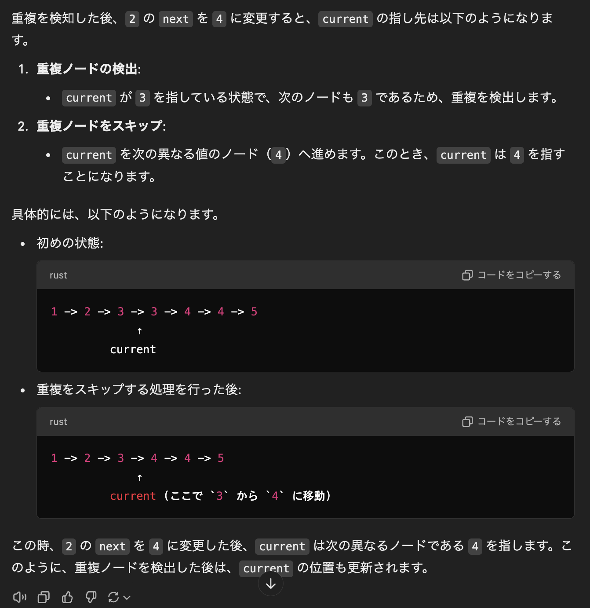

## 目的
- 要素が重複した単方向リストが与えられるので、重複した要素を全て削除して返却せよ

## 解法
- 問題はパターン2の時で、どうやって先頭の要素を削除するかだが、これはダミーで先頭に 0 の Node を追加して最終的に削除すれば良さそう
- current だけ置く方法を模索していたが、これだと解けないっぽいので prev を定義すれば良いことに気がついた

## 別解
- https://github.com/hayashi-ay/leetcode/pull/23/files

## 所感
- いかに脳のメモリーを使わせずに書くか、これに尽きるね

## 1st
```kotlin
    fun deleteDuplicates(head: ListNode?): ListNode? {
        if (head == null) return null
        
        val dummyNode: ListNode? = ListNode(0)
        dummyNode?.next = head

        /// current, prev を定義
        var prev = dummyNode
        var current = head

        while (current != null) {

            /// 重複がある場合
            if (current.next != null && current.`val` == current.next.`val`) {
                /// 重複が2つ以上ある場合を考慮
                while (current?.next != null && current?.`val` == current?.next?.`val`) {
                    current = current?.next
                }
                /// prev.next を重複のないノードに設定
                prev?.next = current?.next
            } else {
                /// 重複がない場合は prev を進める
                prev = prev?.next
            }

            current = current?.next
        }

        return dummyNode?.next
    }
```
- パッと思いつかなかった箇所は見てわかる処理でもコメント残してます(恥ずかしい)
- ダミーを先頭に置くことはすぐに方針として出せた
- 重複が2つより多い場合にどうやって current と prev を管理するか、自分で動かすところでもたついた. chatgpt にだいぶ助けられた
- cf. 
- 相変わらず null チェックしたのに safe call をしないといけないの勘弁してほしい

## 2nd
- うーん、、、難しく感じる。。。
- ネストの中の while ループで比較して重複要素を飛ばしていくのはいいんだけど、インプット例の例のような出力にならないと思うんだよなあ。。
- ポインタ張り替えのタイミングがよくわからないんよなあ
```java
class Solution {
    public ListNode deleteDuplicates(ListNode head) {
        // 早期リターン条件
        if (head == null || head.next == null) return head;

        ListNode dummy = new ListNode(-1, head);
        ListNode left = dummy;
        ListNode right = dummy.next;

        while (right != null) {
            if (right.next != null && right.val == right.next.val) {
                // 重複がなくなるまでスキップ
                while (right.next != null && right.val == right.next.val) {
                    right = right.next;
                }
                // 重複をスキップした後、left.next を更新
                left.next = right.next;
            } else {
                left = left.next;
            }
            right = right.next;
        }

        return dummy.next;
    }
}
```

## 3rd
- 表を書いて理解してみるなどした。すんなり理解できないところが while が回った時のポインタ更新処理と、普通の更新処理がごっちゃになるところ

## 4th

## 5th
