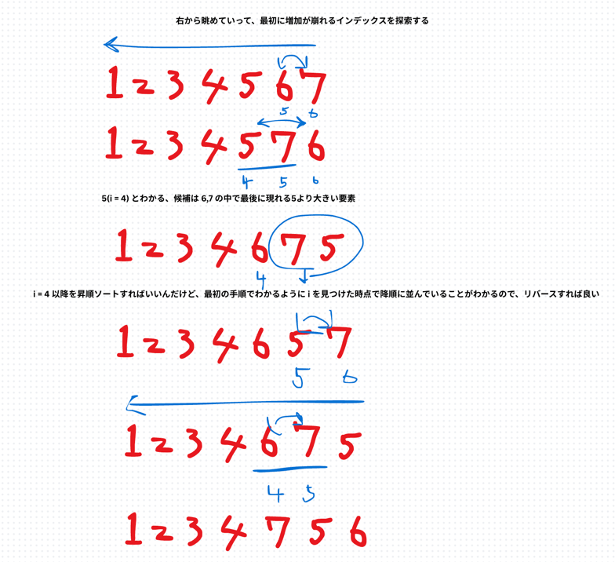

## 1st
- 問題
  - Next Permutations
  - `[1,2,3]` みたいな配列が与えられた時、次の順列に並び替える
  - 次の順序っていうのがよくわからないが、こういうこと
  - 
- 方針
  1. まず右から配列を眺めて、昇順が崩れるインデックス i, i + 1 を見つける
  2. i の要素について、また右から配列を眺めて最も右によっていてかつ `nums[i]` よりも大きい要素を見つける
  3. i と 2 で見つけたインデックスを swap する
  4. swap したら、2で見つけたインデックス以降を昇順に並び替える
    - ⚠️この時、手順1 からわかるように i + 1 以降はすでに降順になっているので、reverse してあげれば良い
    - マージソートとかしなくていいので注意
- 実装
```java
class Solution {
    public void nextPermutation(int[] nums) {
        // nums.length 1の場合そのまま返却
        if (nums.length == 1) return;
        if (nums.length == 2) {
            swap(nums, 0, 1);
            return;
        }

        // 右から線形探索
        for (int i = nums.length - 2; i >= 0; i--) {
            // 右から見て昇順が崩れたポイント i が存在すれば、そこより右端要素を線形探索
            if (nums[i] < nums[i + 1]) {
                for (int j = nums.length - 1; j > i; j--) {
                    if (nums[i] < nums[j]) {
                        // swap
                        swap(nums, i, j);
                        // reverse
                        reverse(nums, i + 1);
                        return;
                    }
                }
            }
        }

        reverse(nums, 0);
    }

    private void swap(int[] nums, int index, int anotherIndex) {
        int temp = nums[index];
        nums[index] = nums[anotherIndex];
        nums[anotherIndex] = temp;
    }

    private void reverse(int[] nums, int startIndex) {
        int start = startIndex;
        int end = nums.length - 1;
        while (start < end) {
            int temp = nums[start];
            nums[start] = nums[end];
            nums[end] = temp;
            start++;
            end--;
        }
    }
}
```
- 初回実装時、`if (nums.length == 2)` で `return` 忘れがあった
- あと二重ループの中で j の探索範囲を j > i ではなく、j > 0 としていた
- 二重ループ内で swap, reverse 後に return で良いのにフラグ管理しようとした
  - そっちの方が permutations の最後[3,2,1]から最初[1,2,3] に直す処理だとより可視化できると考えたが、普通に要らない

## 2nd

## 3rd

## 4th

## 5th
