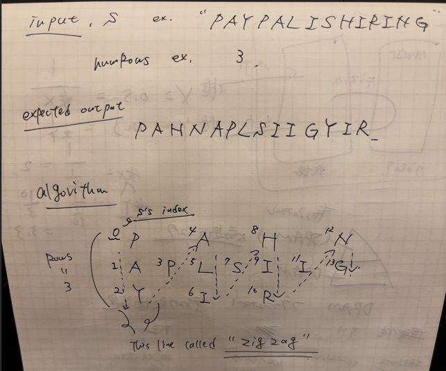
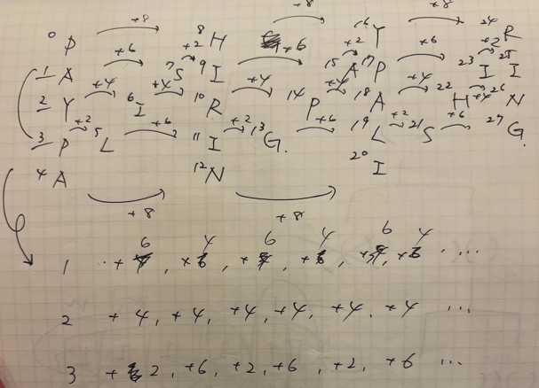

## 1st
- 問題
  - [6. Zigzag Conversion](https://leetcode.com/problems/zigzag-conversion/description/)
  - `PAYPALISHIRING` みたいな文字列と、`numRows`が与えられる
  - 
- 方針
  - `i = 0 ~ numRows` で回しながら、i行に対応する文字を抽出して `StringBuilder` につめる
  - `i == 0 or i == numRows - 1` の時
    - この時、index を飛ばす際の値が同じになる
    - どちらも `2 * (numRows - 1)` で求めることができる
  - `i == 1 ~ numRows - 2` の時
    - この時、上記の場合とは異なり以下のような挙動になる
    - `numRows = 5` の時
      - 
      - `i == 0, numRows - 1` の時、index を飛ばす値が -2 ずつ小さくなっていく
      - さらに、-2 した後の値で index を飛ばした後、今後は `baseIndex - 飛ばしたindexの数` 飛ぶ
      - これが交互に出てくる
  - ここまで理解したので、`numRows` まで回すループの中で、first, last と middle にわけて処理を書けば良さそうと判断
  - 実質二重ループで、s の前要素アクセスが必要なので、計算量は `O(N^2)`、最悪計算量は `10^6`で収まる
- 実装
  - AC はしたけど意味不明なヘルパー関数、意味不明な変数、意味不明な更新処理をしているところがあるので直したい
```java
class Solution {
    public String convert(String s, int numRows) {
        if (s.length() == 1 || numRows == 1) return s;
        int baseInterval = 2 * (numRows - 1);
        int interval = (baseInterval - 2);
        StringBuilder result = new StringBuilder();
        for (int i = 0; i < numRows; i++) {
            if (i == 0 || i == numRows - 1) {
                firstLastHelper(s, i, baseInterval, result);
            } else {
                middleHelper(s, i, interval, baseInterval, result);
                interval -= 2;
            }
        }
        return result.toString();
    }

    private void firstLastHelper(String s, int start, int interval, StringBuilder result) {
        int temp = start;
        while (temp < s.length()) {
            result.append(s.charAt(temp));
            temp += interval;
        }
    }

    private void middleHelper(String s, int start, int interval, int baseInterval, StringBuilder result) {
        boolean toggle = false;
        int temp = start;
        while (temp < s.length()) {
            result.append(s.charAt(temp));
            if (toggle) {
                temp += (baseInterval - interval);
                toggle = false;
            } else {
                temp += interval;
                toggle = true;
            }
        }
    }
}
```
- リファクタ
```java
class Solution {
  public String convert(String s, int numRows) {
    if (numRows == 1 || s.length() <= numRows) return s;

    StringBuilder result = new StringBuilder();
    int cycle = 2 * (numRows - 1);  // 1周期の長さ

    for (int row = 0; row < numRows; row++) {
      int index = row;

      // 最上段と最下段
      if (row == 0 || row == numRows - 1) {
        while (index < s.length()) {
          result.append(s.charAt(index));
          index += cycle;
        }
      } else {
        int stepDown = 2 * (numRows - row - 1); // 斜め下に降りるステップ
        int stepUp = 2 * row;                 // 垂直に上がるステップ
        boolean toggle = true; // 最初は斜め下へ

        while (index < s.length()) {
          result.append(s.charAt(index));
          index += toggle ? stepDown : stepUp;
          toggle = !toggle;
        }
      }
    }
    return result.toString();
  }
}
```
  1. `numRows` が `s.length()` 以上の場合は `return s` でいいらしい
     - ChatGPT がいうにはなので、実際は面接の場で聞かないとかな
  2. 最初のループ、`i` じゃなくて `row` を使おうねと
     - これは確かに、、そっちの方が処理体系を追いやすい
  3. あとは 上段、下段以外のロジックの組み立てかたがきれいかそうでないかかなあ。。。
     - chatGPT が、`stepUp` で定義している部分を見つけられていたら、そっちの方が良かったかな。。

## 2nd

## 3rd

## 4th

## 5th
