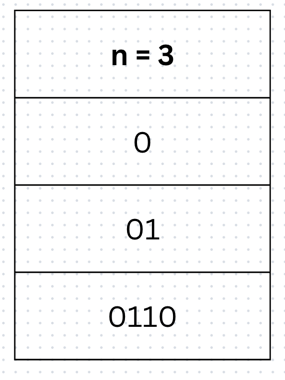
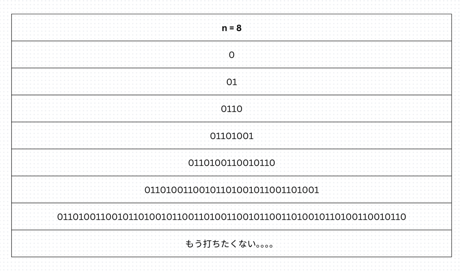
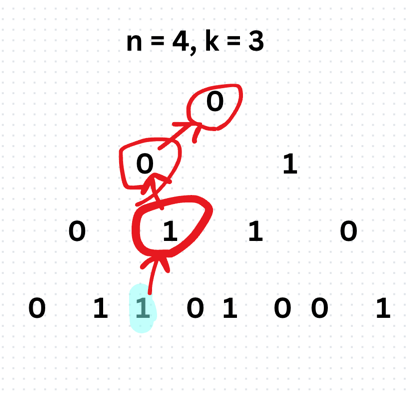
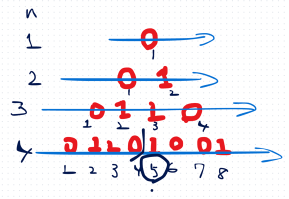

## 1st
- 6/4 18:00 ~ 
- n行1列について、1行目を 0 とする
- 2行目以降、0 を 01, 1 を 10 に変換していく
- ex. n = 3 の時、以下のようになれば良い
- 
- このようなn行1列要素のn行要素の左からk番目を返却する問題
- Constraints:
  - `1 <= n <= 30`
  - `1 <= k <= 2^n - 1`
- 上記から、k は最大 10^9 相当になるから BS っぽくやらないとTLEする
- `n = 8` を考えた時にえらいことになるのは目に見えているので。。
- 
- `n = 8` の時に、3回の計算で返したい
- 再帰で考えることは決まっているので、k を k / 2 としていくようなイメージになるはず。。？
- いや、木をイメージしたほうがわかりいい？
- 18:13 うん、わからん！
```java
public class Solution {
    public int kthGrammar(int n, int k) {
        // ベースケース：最初の行の1文字目は 0
        if (n == 1 && k == 1) {
            return 0;
        }

        // 親のインデックス（k/2、ただし1-indexedなので (k+1)/2）
        int parent = kthGrammar(n - 1, (k + 1) / 2);

        // k が奇数なら親の左の子 → 親と同じ
        // k が偶数なら親の右の子 → 親と反転
        boolean isKEven = k % 2 == 0;
        if (!isKEven) {
            return parent;
        } else {
            return 1 - parent;
        }
    }
}
```
- いったん理解した
- 
- 親の要素は k + 1 / 2 で求まる
- この手の問題、上から考えるか下から考えるかの2パターンで、したからの場合は親の位置重要がちなので覚えちゃいたい

## 2nd
- 方針1 
  - 与えられた n行に対応する 0,1 の置換を組み切り、最後にn行のk番目の要素を返す 
  - n行に対応する文字列の長さは 2^n-1 になるため、String として持つにしても空間計算量が最悪 2^30近辺になるためよろしくない
- 方針2 
  - うまいこと O(log n) で回し切りたい
  - 返したいのはn行k番目の要素なので、その要素から上を見ていくようなイメージで組めば良い
  - スタックに一つ前の要素が載っており、それを参照するイメージなので再帰関数を使う 
  - 1行目の要素から、それ以降のn行要素を決定できる、が気づきポイントかな
  - 時間計算量は O(N)
  - 空間計算量は スタックに載せる int parent の数に相当するので O(N)
  - 
  - 考えながら気づいたこと
    - n 行目に対して、n + 1 行目は、`1 ~ n / 2` の範囲で n行目の要素と完全に一致している
```java
class Solution {
    public int kthGrammar(int n, int k) {
        if (n == 1 && k == 1) return 0;
        int parent = kthGrammar(n - 1, (k + 1) / 2);

        // 親の要素が 0
        if (parent % 2 == 0) {
            // インデックスが 偶数
            if (k % 2 == 0) {
                return 1 - parent;
            } 
            // インデックスが 奇数
            else {
                return parent;
            }
        } 
        // 親の要素が 1
        else {
            // インデックスが偶数
            if (k % 2  == 0) {
                return 1 - parent;
            } 
            // インデックスが奇数
            else {
                return parent;
            }
        }
    }
}
```


## 3rd

## 4th

## 5th
