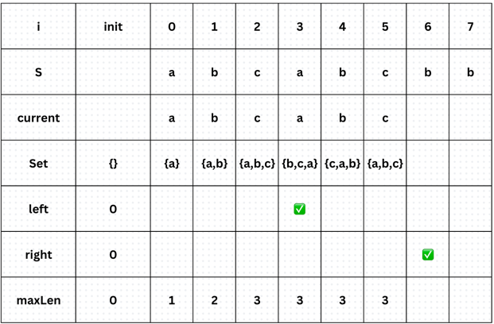

## 1st
- 問題
  - 連続する文字列において、重複要素のない最大長を求める
  - DP word break っぽく解けると思ったけど、これだと substring に対して毎回 Set の生成、破棄を繰り返さないといけない
  - かつ、O(N^2) の計算量になるため採用しない
  - sliding window の利点は O(N) で済み、かつ Set の生成、破棄を繰り返さなくていいところ
```java
public int lengthOfLongestSubstring(String s) {
    Set<Character> set = new HashSet<>();
    int left = 0, right = 0, maxLen = 0;

    while (right < s.length()) {
        char c = s.charAt(right);
        while (set.contains(c)) {
            set.remove(s.charAt(left));
            left++;
        }
        set.add(c);
        maxLen = Math.max(maxLen, right - left + 1);
        right++;
    }

    return maxLen;
}
```
- 視覚化
  - 初期状態
    - 
    - 
    - 
    - 
    - 
    - 
    - 
    - 
    - 
    - 
- 初回の感想は「なんかいまいちよくわからん」
  - 
  - 別で書き出してみたけどやっぱわからん

## 2nd

## 3rd

## 4th

## 5th
