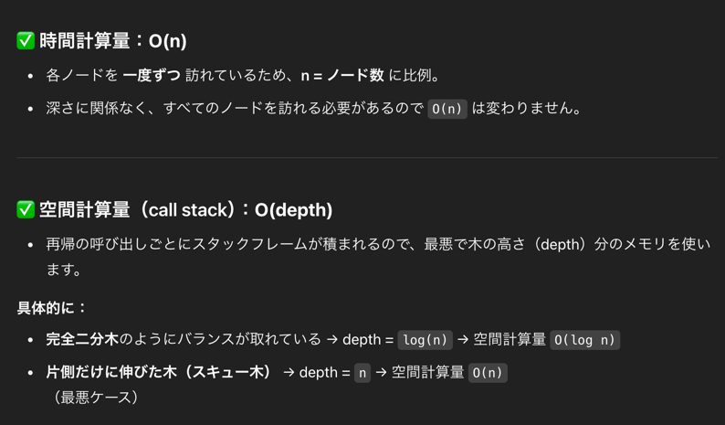

## 1st
- バイナリツリーの root が与えられるので、最も深い数を返却する問題
- 深いとは: root ノードから最も遠い葉ノードまでの数、root を含める
- 方針
  - root ノードから見て左右ノードを left, right としてわけ、これらを辿らせる再帰関数を作成する
- 初見実装 (10分)
```java
/**
 * Definition for a binary tree node.
 * public class TreeNode {
 *     int val;
 *     TreeNode left;
 *     TreeNode right;
 *     TreeNode() {}
 *     TreeNode(int val) { this.val = val; }
 *     TreeNode(int val, TreeNode left, TreeNode right) {
 *         this.val = val;
 *         this.left = left;
 *         this.right = right;
 *     }
 * }
 */
class Solution {
    public int maxDepth(TreeNode root) {
        if (root == null) return 0;
        int left = count(root.left) + 1;
        int right = count(root.right) + 1;
        return Math.max(left, right);
    }

    private int count(TreeNode node) {
        if (node == null) return 0;
        if (node.left == null && node.right == null) return 1;
        if (node.left == null && node.right != null) {
            return count(node.right) + 1;
        }
        if (node.left != null && node.right == null) {
            return count(node.left) + 1;
        }
        return Math.max(count(node.left) + 1, count(node.right) + 1);
    }
}
```
- もっとシンプルに描けるので描き直し
```java
/**
 * Definition for a binary tree node.
 * public class TreeNode {
 *     int val;
 *     TreeNode left;
 *     TreeNode right;
 *     TreeNode() {}
 *     TreeNode(int val) { this.val = val; }
 *     TreeNode(int val, TreeNode left, TreeNode right) {
 *         this.val = val;
 *         this.left = left;
 *         this.right = right;
 *     }
 * }
 */
class Solution {
    public int maxDepth(TreeNode root) {
        if (root == null) return 0;

        // ここのアクセスは問題ないんだっけ？
        int left = maxDepth(root.left);
        int right = maxDepth(root.right);

        return Math.max(left, right) + 1;
    }
}
```
- 時間計算量 、空間計算量
  
- BFS, DFS で解く方法もあって楽しいね

#### BFS
- ひたすら Queue につめていく、こっちもかなりわかりやすいし再帰でスタックに積む量がめちゃ多い場合はこっちの方が良いね
```java
class Solution {
    public int maxDepth(TreeNode root) {
        if (root == null) return 0;

        Queue<TreeNode> queue = new LinkedList<>();
        queue.add(root);
        int depth = 0;

        while (!queue.isEmpty()) {
            int levelSize = queue.size(); // 今の深さにあるノードの数
            for (int i = 0; i < levelSize; i++) {
                TreeNode node = queue.poll();
                if (node.left != null) queue.add(node.left);
                if (node.right != null) queue.add(node.right);
            }
            depth++;
        }

        return depth;
    }
}
```

#### DFS
- ひたすらスタックに詰めていく
- こっちの方が直感的に理解しやすくて良いね
```java
class Solution {
    public int maxDepth(TreeNode root) {
        if (root == null) return 0;

        Stack<Pair<TreeNode, Integer>> stack = new Stack<>();
        stack.push(new Pair<>(root, 1));
        int maxDepth = 0;

        while (!stack.isEmpty()) {
            Pair<TreeNode, Integer> current = stack.pop();
            TreeNode node = current.getKey();
            int depth = current.getValue();
            if (node != null) {
                maxDepth = Math.max(maxDepth, depth);
                if (node.left != null) stack.push(new Pair<>(node.left, depth + 1));
                if (node.right != null) stack.push(new Pair<>(node.right, depth + 1));
            }
        }

        return maxDepth;
    }
}
```


## 2nd
### DFS + 再帰
- left, right に分けなくてもまあ書けるよね
- あとはどこに着目するの？が大事だよなあ
  - leaf なの？枝なの？null ノードなの？で分けられるからなあ
  - 筋よく分けたい
```java
/**
 * Definition for a binary tree node.
 * public class TreeNode {
 *     int val;
 *     TreeNode left;
 *     TreeNode right;
 *     TreeNode() {}
 *     TreeNode(int val) { this.val = val; }
 *     TreeNode(int val, TreeNode left, TreeNode right) {
 *         this.val = val;
 *         this.left = left;
 *         this.right = right;
 *     }
 * }
 */
class Solution {
    public int maxDepth(TreeNode root) {
      if (root == null) return 0;
      // これいらないんだよね、leaf ノードに注目しすぎているけど、if (root == null) return 0 で以下のコード包括しちゃっているからね
      // そういうところだぞ
      if (root.left == null && root.right == null) return 1;
      return Math.max(maxDepth(root.left), maxDepth(root.right)) + 1;
    }
}
```

## 3rd
### DFS + 再帰
```java
/**
 * Definition for a binary tree node.
 * public class TreeNode {
 *     int val;
 *     TreeNode left;
 *     TreeNode right;
 *     TreeNode() {}
 *     TreeNode(int val) { this.val = val; }
 *     TreeNode(int val, TreeNode left, TreeNode right) {
 *         this.val = val;
 *         this.left = left;
 *         this.right = right;
 *     }
 * }
 */
class Solution {
    public int maxDepth(TreeNode root) {
        if (root == null) return 0;
        int left = maxDepth(root.left);
        int right = maxDepth(root.right);

        return Math.max(left, right) + 1;
    }
}
```

### BFS
- Pair を使うのがいかがなものか？と思い始めてきた
- より可読性を突き詰めるなら、Pair ではなく CurrentNode class を作った方がいいかもな
```java
/**
 * Definition for a binary tree node.
 * public class TreeNode {
 *     int val;
 *     TreeNode left;
 *     TreeNode right;
 *     TreeNode() {}
 *     TreeNode(int val) { this.val = val; }
 *     TreeNode(int val, TreeNode left, TreeNode right) {
 *         this.val = val;
 *         this.left = left;
 *         this.right = right;
 *     }
 * }
 */
class Solution {
    public int maxDepth(TreeNode root) {
        if (root == null) return 0;

        Queue<Pair<TreeNode, Integer>> queue = new LinkedList<>();
        queue.add(new Pair(root, 1));
        Integer maxDepth = Integer.MIN_VALUE;

        while (!queue.isEmpty()) {
            Pair<TreeNode, Integer> currentPair = queue.poll();
            TreeNode node = currentPair.getKey();
            Integer currentDepth = currentPair.getValue();

            maxDepth = Math.max(maxDepth, currentDepth);

            if (node.left != null) {
                queue.add(new Pair(node.left, currentDepth + 1));
            }

            if (node.right != null) {
                queue.add(new Pair(node.right, currentDepth + 1));
            }
        }

        return maxDepth;
    }
}
```

## 4th

## 5th
