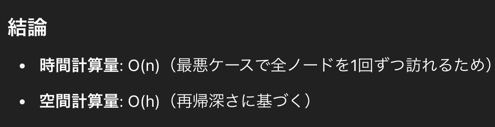

## 1st
- root からノードを辿って和を取り、targetNum と一致したら true, false を返却
- イージーな気がするので、再帰と BFS の両方で解いていく

### DFS
- 方針
  - ルートノードから辿っていく時に targetNum から 現在のノード val を引いて下に渡していく
  - 今までのスタックに積むんだから下から考えればいいんだよね？という発想を破壊されて、上からでもできるんやでってなると「うん？？？」ってなるんだよな
```java
/**
 * Definition for a binary tree node.
 * public class TreeNode {
 *     int val;
 *     TreeNode left;
 *     TreeNode right;
 *     TreeNode() {}
 *     TreeNode(int val) { this.val = val; }
 *     TreeNode(int val, TreeNode left, TreeNode right) {
 *         this.val = val;
 *         this.left = left;
 *         this.right = right;
 *     }
 * }
 */
class Solution {
    public boolean hasPathSum(TreeNode root, int targetSum) {
        if (root == null) return false;

        // leaf node に到達
        if (root.left == null && root.right == null) {
            if (targetSum == root.val) return true;
            else return false;
        }

        // 左に子ノードを持つ
        if (root.left != null && root.right == null) {
            return hasPathSum(root.left, targetSum - root.val);
        }

        // 右に子ノードを持つ
        if (root.right != null && root.left == null) {
            return hasPathSum(root.right, targetSum - root.val);
        }

        // 左右に子ノードを持つ
        return hasPathSum(root.left, targetSum - root.val)
                || hasPathSum(root.right, targetSum - root.val);
    }
}
```
- 綺麗に書き直し
```java
/**
 * Definition for a binary tree node.
 * public class TreeNode {
 *     int val;
 *     TreeNode left;
 *     TreeNode right;
 *     TreeNode() {}
 *     TreeNode(int val) { this.val = val; }
 *     TreeNode(int val, TreeNode left, TreeNode right) {
 *         this.val = val;
 *         this.left = left;
 *         this.right = right;
 *     }
 * }
 */
class Solution {
    public boolean hasPathSum(TreeNode root, int targetSum) {
        if (root == null) return false;

        // leaf node に到達
        if (root.left == null && root.right == null) {
            if (targetSum == root.val) return true;
            else return false;
        }

        // 左右に子ノードを持つ
        return (root.left != null && hasPathSum(root.left, targetSum - root.val))
            || (root.right != null && hasPathSum(root.right, targetSum - root.val));
    }
}
```
- 時間計算量
  - tree の高さを h とすると `O(h)`
- 空間計算量
  - tree の高さを h とすると `O(h)`
- chatGpt 先生
  

### BFS
- DFS とは方針を変えて、より直感的な root から末尾までの累積和を記録する方針とした
```java
/**
 * Definition for a binary tree node.
 * public class TreeNode {
 *     int val;
 *     TreeNode left;
 *     TreeNode right;
 *     TreeNode() {}
 *     TreeNode(int val) { this.val = val; }
 *     TreeNode(int val, TreeNode left, TreeNode right) {
 *         this.val = val;
 *         this.left = left;
 *         this.right = right;
 *     }
 * }
 */
class Solution {
    public boolean hasPathSum(TreeNode root, int targetSum) {
        if (root == null) return false;

        Queue<Pair<TreeNode, Integer>> queue = new LinkedList<>();
        queue.add(new Pair<TreeNode, Integer>(root, root.val));

        while (!queue.isEmpty()) {
            Pair<TreeNode, Integer> current = queue.poll();
            TreeNode node = current.getKey();
            int value = current.getValue();

            // when reach leaf node
            if (node.left == null 
                    && node.right == null 
                    && value == targetSum) {
                return true;
            }

            // go left node
            if (node.left != null) {
                queue.add(new Pair<TreeNode, Integer>(node.left, value + node.left.val));
            }

            // go right node
            if (node.right != null) {
                queue.add(new Pair<TreeNode, Integer>(node.right, value + node.right.val));
            }
        }

        return false;
    }
}
```
- 時間計算量
  - `O(N)` 最悪全探索になるから
- 空間計算量
  - `O(N)` Queue に積むオブジェクトの数が最悪で tree.size になるから

## 2nd
- 方針
  - この問題は BFS の方が適しているような気がする、DFS もやるけれども
### BFS
```java
/**
 * Definition for a binary tree node.
 * public class TreeNode {
 *     int val;
 *     TreeNode left;
 *     TreeNode right;
 *     TreeNode() {}
 *     TreeNode(int val) { this.val = val; }
 *     TreeNode(int val, TreeNode left, TreeNode right) {
 *         this.val = val;
 *         this.left = left;
 *         this.right = right;
 *     }
 * }
 */
class Solution {
    public boolean hasPathSum(TreeNode root, int targetSum) {
        // 探索系なので BFS が使いやすい
        // 直感的に足し合せで考えるのがいいな
        if (root == null) return false;

        Queue<Pair<TreeNode, Integer>> queue = new LinkedList<>();
        queue.add(new Pair(root, root.val));

        while (!queue.isEmpty()) {
            Pair<TreeNode, Integer> pair = queue.poll();
            TreeNode currentNode = pair.getKey();
            int prefixSum = pair.getValue();

            // leaf node 
            if (currentNode.left == null && currentNode.right == null) {
                if (prefixSum == targetSum) return true;
            }

            if (currentNode.left != null) {
                queue.add(new Pair(currentNode.left, prefixSum + currentNode.left.val));
            }

            if (currentNode.right != null) {
                queue.add(new Pair(currentNode.right, prefixSum + currentNode.right.val));
            }
        }

        return false;
    }
}
```

### DFS(再帰)
```java
/**
 * Definition for a binary tree node.
 * public class TreeNode {
 *     int val;
 *     TreeNode left;
 *     TreeNode right;
 *     TreeNode() {}
 *     TreeNode(int val) { this.val = val; }
 *     TreeNode(int val, TreeNode left, TreeNode right) {
 *         this.val = val;
 *         this.left = left;
 *         this.right = right;
 *     }
 * }
 */
class Solution {
    public boolean hasPathSum(TreeNode root, int targetSum) {
        if (root == null) return false;

        // leaf node
        if (root.left == null && root.right == null) {
            if (targetSum == root.val) return true;
        }

        // left, right
        boolean left = hasPathSum(root.left, targetSum - root.val);
        boolean right = hasPathSum(root.right, targetSum - root.val);
        return left || right;
    }
}
```
## 3rd
- BFS: 9分
```java
/**
 * Definition for a binary tree node.
 * public class TreeNode {
 *     int val;
 *     TreeNode left;
 *     TreeNode right;
 *     TreeNode() {}
 *     TreeNode(int val) { this.val = val; }
 *     TreeNode(int val, TreeNode left, TreeNode right) {
 *         this.val = val;
 *         this.left = left;
 *         this.right = right;
 *     }
 * }
 */
class Solution {
    public boolean hasPathSum(TreeNode root, int targetSum) {
        // 合致する条件があれば即座に return したいので BFS がベスト？
        // DFS でも解けそう
        // どっちが効率がいい？
        // まず BFS で

        if (root == null) return false;

        Queue<Pair<TreeNode, Integer>> queue = new LinkedList<>();
        queue.add(new Pair(root, root.val));

        while (!queue.isEmpty()) {
            Pair<TreeNode, Integer> pair = queue.poll();
            TreeNode node = pair.getKey();
            Integer  prefixSum = pair.getValue();

            // leaf node
            if (node.left == null && node.right == null) {
                if (prefixSum == targetSum) return true;
            }

            if (node.left != null) {
                queue.add(new Pair(node.left, prefixSum + node.left.val));
            }

            if (node.right != null) {
                queue.add(new Pair(node.right, prefixSum + node.right.val));
            }
        }

        return false;
    }
}
```

- DFS: 10分
```java
/**
 * Definition for a binary tree node.
 * public class TreeNode {
 *     int val;
 *     TreeNode left;
 *     TreeNode right;
 *     TreeNode() {}
 *     TreeNode(int val) { this.val = val; }
 *     TreeNode(int val, TreeNode left, TreeNode right) {
 *         this.val = val;
 *         this.left = left;
 *         this.right = right;
 *     }
 * }
 */
class Solution {
    public boolean hasPathSum(TreeNode root, int targetSum) {
        // DFS でも解いてみる
        // BFS のような加算は引数が 3つ必要でもう一つメソッドを生やさないといけないので減算を使う
        if (root == null) return false;

        int prefixDifference = targetSum - root.val;

        // leaf node
        if (root.left == null && root.right == null) {
            if (prefixDifference == 0) return true;
        }

        return hasPathSum(root.left, prefixDifference) || hasPathSum(root.right, prefixDifference);
    }
}
```
## 4th

## 5th
