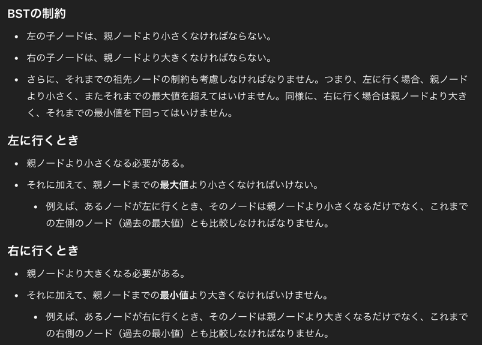

## 1st
- 二分木のルートが与えられるので、有効な二分木かどうか判定して true/false を返すプログラムを作成せよ
  - 有効とは？
    - ノードの左サブツリーには、そのノードより小さいキーを持つノードのみが含まれる
    - 同様に、右のサブツリーには、そのノードより大きいキーを持つノードだけが含まれる
      

### BFS
- 方針は Queue につめながら node, 最大値、最小値を更新していく方法
- Java には Triple が無いので自作した
```java
/**
 * Definition for a binary tree node.
 * public class TreeNode {
 *     int val;
 *     TreeNode left;
 *     TreeNode right;
 *     TreeNode() {}
 *     TreeNode(int val) { this.val = val; }
 *     TreeNode(int val, TreeNode left, TreeNode right) {
 *         this.val = val;
 *         this.left = left;
 *         this.right = right;
 *     }
 * }
 */
class Solution {
    public boolean isValidBST(TreeNode root) {
        // when null node
        if (root == null) return false;
        if (root.left == null && root.right == null) return true;

        Queue<Triple> queue = new LinkedList<>();
        queue.add(new Triple(root, Long.MAX_VALUE, Long.MIN_VALUE));

        while (!queue.isEmpty()) {
            Triple triple = queue.poll();
            TreeNode node = triple.getTreeNode();
            Long max = triple.getMax();
            Long min = triple.getMin();

            // 完全木に合致しない場合に break したいよね？
            // 異常系を検知したいので、node.val < node.left.val を検査
            if (node.left != null) {
                if (node.left.val <= min || node.left.val >= node.val) return false;
                queue.add(new Triple(node.left, (long) node.val, min));
            }

            if (node.right != null) {
                if (node.right.val >= max || node.right.val <= node.val) return false;
                queue.add(new Triple(node.right, max, (long) node.val));
            }
        }
        return true;
    }

    class Triple {
        TreeNode node;
        Long max;
        Long min;

        Triple(TreeNode node, Long max, Long min) {
            this.node = node;
            this.max = max;
            this.min = min;
        }

        TreeNode getTreeNode() {
            return this.node;
        }

        Long getMax() {
            return this.max;
        }

        Long getMin() {
            return this.min;
        }
    }
}
```
- 時間計算量
    - 全要素探索なので、tree.size に依存する、n とするので O(N)
- 空間計算量
    - Queue に詰める際にメモリ使うので、tree.size に依存して O(N)

## 2nd
- 方針は BFS
```java
/**
 * Definition for a binary tree node.
 * public class TreeNode {
 *     int val;
 *     TreeNode left;
 *     TreeNode right;
 *     TreeNode() {}
 *     TreeNode(int val) { this.val = val; }
 *     TreeNode(int val, TreeNode left, TreeNode right) {
 *         this.val = val;
 *         this.left = left;
 *         this.right = right;
 *     }
 * }
 */
class Solution {
    public boolean isValidBST(TreeNode root) {
        // BFS, DFS でもいけるっちゃいけそう
        // min と max を保持し続ける必要がある

        if (root == null) return false;

        // 左に行く時は最大値を渡し続ける
        // 右に行く時は最小値を渡し続ける
        Queue<Triple> queue = new LinkedList();
        // -2^31 の判定処理のため long を使う
        queue.add(new Triple(root, Long.MIN_VALUE, Long.MAX_VALUE));

        while (!queue.isEmpty()) {
            Triple triple = queue.poll();
            TreeNode node = triple.getCurrentNode();
            long min = triple.getMinimumVal();
            long max = triple.getMaximumVal();

            // min, max の範囲外なら即 return
            if (node.val <= min || max <= node.val) return false;

            if (node.left != null) {
                queue.add(new Triple(node.left, min, node.val));
            }

            if (node.right != null) {
                queue.add(new Triple(node.right, node.val, max));
            }
        }

        return true;
    }


    class Triple {
        private TreeNode node;
        private long min;
        private long max;

        Triple(TreeNode node, long min, long max) {
            this.node = node;
            this.min  = min;
            this.max  = max;
        }

        TreeNode getCurrentNode() {
            return this.node;
        }

        long getMinimumVal() {
            return this.min;
        }

        long getMaximumVal() {
            return this.max;
        }
    }
}
```
## 3rd
- DFS でもいけるやろということで解いてみた
- 所要時間: 30分
```java
/**
 * Definition for a binary tree node.
 * public class TreeNode {
 *     int val;
 *     TreeNode left;
 *     TreeNode right;
 *     TreeNode() {}
 *     TreeNode(int val) { this.val = val; }
 *     TreeNode(int val, TreeNode left, TreeNode right) {
 *         this.val = val;
 *         this.left = left;
 *         this.right = right;
 *     }
 * }
 */
class Solution {
    public boolean isValidBST(TreeNode root) {
        // 先に DFS で解いてみる
        long min = Long.MIN_VALUE;
        long max = Long.MAX_VALUE;
        return isValidBSTHelper(root, min, max);
    }

    private boolean isValidBSTHelper(TreeNode root, long min, long max) {
        // BST において、空の木も valid とみなせるため true. 
        // 再起処理的にも false が投げられることなく null ノードへ到達したという意味で true を返している
        if (root == null) return true;
        // is Not valid を真っ先に見つけることを優先とする意図で書いてみた
        if (root.val <= min || root.val >= max) return false;

        return isValidBSTHelper(root.left, min, root.val) && isValidBSTHelper(root.right, root.val, max);
    }
}
```

### BFS
- BFS: 20分
```java
/**
 * Definition for a binary tree node.
 * public class TreeNode {
 *     int val;
 *     TreeNode left;
 *     TreeNode right;
 *     TreeNode() {}
 *     TreeNode(int val) { this.val = val; }
 *     TreeNode(int val, TreeNode left, TreeNode right) {
 *         this.val = val;
 *         this.left = left;
 *         this.right = right;
 *     }
 * }
 */
class Solution {
    public boolean isValidBST(TreeNode root) {
        // BFS
        Queue<Triple> queue = new LinkedList<>();
        long max = Long.MAX_VALUE;
        long min = Long.MIN_VALUE;
        queue.add(new Triple(root, max, min));

        while (!queue.isEmpty()) {
            Triple triple = queue.poll();
            TreeNode node = triple.getNode();
            long currentMax = triple.getMax();
            long currentMin = triple.getMin();

            if (node.val <= currentMin || node.val >= currentMax) return false;

            if (node.left != null) queue.add(new Triple(node.left, node.val, currentMin));
            if (node.right != null) queue.add(new Triple(node.right, currentMax, node.val));
        }

        return true;
    }

    class Triple {
        TreeNode node;
        long max;
        long min;

        Triple(TreeNode node, long max, long min) {
            this.node = node;
            this.max  = max;
            this.min  = min;
        }

        TreeNode getNode() {
            return this.node;
        }

        long getMax() {
            return this.max;
        }

        long getMin() {
            return this.min;
        }
    }
}
```

## 4th

## 5th